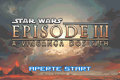
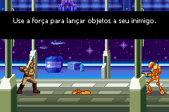

# Star Wars - Episode III - Revenge of the Sith

## Informações sobre o jogo

| Tipo | Informação |
| ----------- | ----------- |
| Nome | Star Wars \- Episode III \- Revenge of the Sith |
| Plataforma | [Game Boy Advance](../) |
| Desenvolvedora | Ubisoft |
| Distribuidora | Ubisoft |
| Gênero | Beat 'em up |
| Data de Lançamento | 05/05/2005 |

## Informações sobre a tradução

| Tipo | Informação |
| ----------- | ----------- |
| Última versão | Sim |
| Data de Lançamento | 28/11/2008 |
| Percentual traduzido | None% |

## Autores

| Autor(a) | Papel na tradução |
| ----------- | ----------- |
| [Amonia](../../../autores/amonia/) | Completo |

## Grupos

* [BR Traduções](../../../grupos/br-traducoes/)

## Informações sobre patching

| Aplicar o patch no arquivo | CRC32 Hash | MD5 Hash |
| ----------- | ----------- | ----------- |
| Star Wars \- Episode III \- Revenge of the Sith \(U\)\.gba | 3E34AAB7 | 6C44B49D69E6C0576197742F20250C40 |

## Páginas sobre a tradução

| URL | Oficial (publicado pelos autores) | Possuí link de download |
| ----------- | ----------- | ----------- |
| [https://romhackers.org/traducoes/portatil/game-boy-advance/star-wars-episode-iii-revenge-of-the-sith-br-traducoes/](https://romhackers.org/traducoes/portatil/game-boy-advance/star-wars-episode-iii-revenge-of-the-sith-br-traducoes/) | Não | Sim |
| [https://www.zophar.net/translations/gameboy-advance/brazilian-portuguese/star-wars-episode-iii-revenge-of-the-sith-dak.html](https://www.zophar.net/translations/gameboy-advance/brazilian-portuguese/star-wars-episode-iii-revenge-of-the-sith-dak.html) | Não | Sim |

## Imagens da tradução

