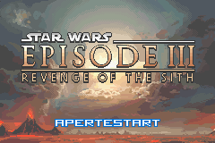
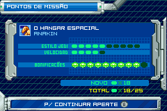

# Star Wars - Episode III - Revenge of the Sith

## Informações sobre o jogo

| Tipo | Informação |
| ----------- | ----------- |
| Nome | Star Wars \- Episode III \- Revenge of the Sith |
| Plataforma | [Game Boy Advance](../) |
| Desenvolvedora | Ubisoft |
| Distribuidora | Ubisoft |
| Gênero | Beat 'em up |
| Data de Lançamento | 05/05/2005 |

## Informações sobre a tradução

| Tipo | Informação |
| ----------- | ----------- |
| Versão | 1\.1 |
| Última versão | Sim |
| Data de Lançamento | 13/04/2006 |
| Percentual traduzido | 100% |

## Autores

| Autor(a) | Papel na tradução |
| ----------- | ----------- |
| [Game Master](../../../autores/game-master/) | Completo |
| [Kick Master](../../../autores/kick-master/) | Romhacking e revisão |

## Grupos

* [Central de Traduções](../../../grupos/central-de-traducoes/)

## Informações sobre patching

| Aplicar o patch no arquivo | CRC32 Hash | MD5 Hash |
| ----------- | ----------- | ----------- |
| Star Wars \- Episode III \- Revenge of the Sith \(E\)\.gba | FD49236B | 8942D8C65E680853E1407108857BB732 |

## Páginas sobre a tradução

| URL | Oficial (publicado pelos autores) | Possuí link de download |
| ----------- | ----------- | ----------- |
| [https://romhackers.org/traducoes/portatil/game-boy-advance/star-wars-episode-iii-revenge-of-the-sith-central-de-traducoes/](https://romhackers.org/traducoes/portatil/game-boy-advance/star-wars-episode-iii-revenge-of-the-sith-central-de-traducoes/) | Não | Sim |
| [https://www.zophar.net/translations/gameboy-advance/brazilian-portuguese/star-wars-episode-iii-revenge-of-the-sith.html](https://www.zophar.net/translations/gameboy-advance/brazilian-portuguese/star-wars-episode-iii-revenge-of-the-sith.html) | Não | Sim |

## Imagens da tradução

