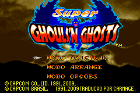

# Super Ghouls 'N Ghosts

## Informações sobre o jogo

| Tipo | Informação |
| ----------- | ----------- |
| Nome | Super Ghouls 'N Ghosts |
| Plataforma | [Game Boy Advance](../) |
| Desenvolvedora | Capcom |
| Distribuidora | Capcom |
| Gênero | Ação / Plataforma |
| Data de Lançamento | (Por volta de) ??/??/2002 |

## Informações sobre a tradução

| Tipo | Informação |
| ----------- | ----------- |
| Versão | 1\.0 |
| Última versão | Sim |
| Data de Lançamento | 10/02/2009 |
| Percentual traduzido | 100% |

## Autores

| Autor(a) | Papel na tradução |
| ----------- | ----------- |
| [ØX\-Carnage](../../../autores/x-carnage/) | Completo |

## Grupos

* [Monkey's Traduções](../../../grupos/monkeys-traducoes/)

## Informações sobre patching

| Aplicar o patch no arquivo | CRC32 Hash | MD5 Hash |
| ----------- | ----------- | ----------- |
| Super Ghouls 'N Ghosts \(U\)\.gba | 1EF2ACF3 | 37FF7A1DE0322B72A6B41DEA0BA53673 |

## Páginas sobre a tradução

| URL | Oficial (publicado pelos autores) | Possuí link de download |
| ----------- | ----------- | ----------- |
| [https://romhackers.org/traducoes/portatil/game-boy-advance/super-ghouls-n-ghosts-monkeys-traducoes/](https://romhackers.org/traducoes/portatil/game-boy-advance/super-ghouls-n-ghosts-monkeys-traducoes/) | Não | Sim |
| [https://www.zophar.net/translations/gameboy-advance/brazilian-portuguese/super-ghouls-n-ghosts.html](https://www.zophar.net/translations/gameboy-advance/brazilian-portuguese/super-ghouls-n-ghosts.html) | Não | Sim |

## Imagens da tradução

