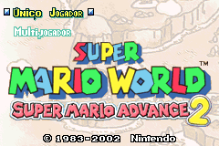
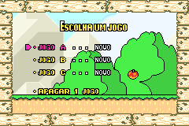
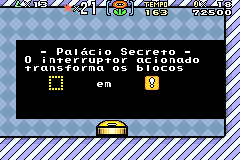

# Super Mario Advance 2 - Super Mario World

## Informações sobre o jogo

| Tipo | Informação |
| ----------- | ----------- |
| Nome | Super Mario Advance 2 \- Super Mario World |
| Plataforma | [Game Boy Advance](../) |
| Desenvolvedora | Nintendo |
| Distribuidora | Nintendo |
| Gênero | Ação / Plataforma |
| Data de Lançamento | 09/02/2002 |

## Informações sobre a tradução

| Tipo | Informação |
| ----------- | ----------- |
| Versão | 2\.0 |
| Última versão | Sim |
| Data de Lançamento | (Provavelmente) 19/10/2016 |
| Percentual traduzido | 90% |

## Autores

| Autor(a) | Papel na tradução |
| ----------- | ----------- |
| [Iago Ariel](../../../autores/iago-ariel/) | Completo |

## Informações sobre patching

| Aplicar o patch no arquivo | CRC32 Hash | MD5 Hash |
| ----------- | ----------- | ----------- |
| Super Mario Advance 2 \- Super Mario World \(U\) \[\!\]\.gba | 5206880A | 2F660377581B7E48C06131F56C791B72 |

## Páginas sobre a tradução

| URL | Oficial (publicado pelos autores) | Possuí link de download |
| ----------- | ----------- | ----------- |
| [https://romhackers.org/traducoes/portatil/game-boy-advance/super-mario-advance-2-super-mario-world-iago-ariel/](https://romhackers.org/traducoes/portatil/game-boy-advance/super-mario-advance-2-super-mario-world-iago-ariel/) | Não | Sim |

## Imagens da tradução

