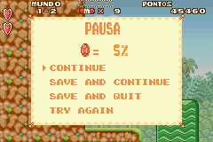

# Super Mario Advance

## Informações sobre o jogo

| Tipo | Informação |
| ----------- | ----------- |
| Nome | Super Mario Advance |
| Plataforma | [Game Boy Advance](../) |
| Desenvolvedora | Nintendo |
| Distribuidora | Nintendo |
| Gênero | Ação / Plataforma |
| Data de Lançamento | (Por volta de) ??/??/2001 |

## Informações sobre a tradução

| Tipo | Informação |
| ----------- | ----------- |
| Última versão | Sim |
| Data de Lançamento | (Provavelmente) 06/06/2005 |
| Percentual traduzido | None% |

## Autores

| Autor(a) | Papel na tradução |
| ----------- | ----------- |
| [Eder Pezão](../../../autores/eder-pezao/) | Completo |

## Informações sobre patching

| Aplicar o patch no arquivo | CRC32 Hash | MD5 Hash |
| ----------- | ----------- | ----------- |
| Super Mario Advance \(U\) \[\!\]\.gba | 69924CBD | 7B0C63D4080F79396C0545A86CC1ADBA |

## Páginas sobre a tradução

| URL | Oficial (publicado pelos autores) | Possuí link de download |
| ----------- | ----------- | ----------- |
| [https://romhackers.org/traducoes/portatil/game-boy-advance/super-mario-advance-eder-pezao/](https://romhackers.org/traducoes/portatil/game-boy-advance/super-mario-advance-eder-pezao/) | Não | Sim |
| [https://www.zophar.net/translations/gameboy-advance/brazilian-portuguese/super-mario-advance.html](https://www.zophar.net/translations/gameboy-advance/brazilian-portuguese/super-mario-advance.html) | Não | Sim |

## Imagens da tradução

