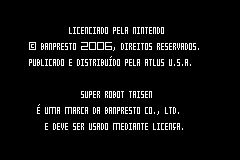
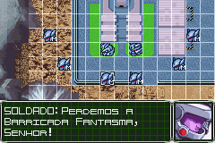
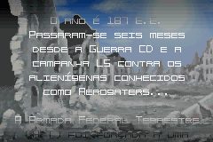
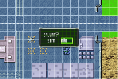
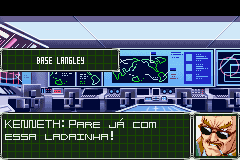
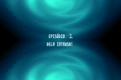
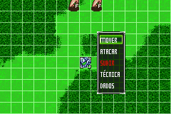
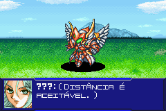

# Super Robot Taisen - Original Generation 2

## Informações sobre o jogo

| Tipo | Informação |
| ----------- | ----------- |
| Nome | Super Robot Taisen \- Original Generation 2 |
| Plataforma | [Game Boy Advance](../) |
| Desenvolvedora | Banpresto |
| Distribuidora | Atlus |
| Gênero | Estratégia |
| Data de Lançamento | 14/11/2006 |

## Informações sobre a tradução

| Tipo | Informação |
| ----------- | ----------- |
| Versão | 1\.0 |
| Última versão | Sim |
| Data de Lançamento | 19/09/2014 |
| Percentual traduzido | 82% |

## Autores

| Autor(a) | Papel na tradução |
| ----------- | ----------- |
| [Pinguimbozo](../../../autores/pinguimbozo/) | Completo |

## Informações sobre patching

| Aplicar o patch no arquivo | CRC32 Hash | MD5 Hash |
| ----------- | ----------- | ----------- |
| Super Robot Taisen \- Original Generation 2 \(U\)\.gba | 2AEE0380 | F3D168D87D3E2AE25DBEC012471CD9B5 |

## Páginas sobre a tradução

| URL | Oficial (publicado pelos autores) | Possuí link de download |
| ----------- | ----------- | ----------- |
| [https://romhackers.org/traducoes/portatil/game-boy-advance/super-robot-taisen-original-generation-2-pinguimbozo/](https://romhackers.org/traducoes/portatil/game-boy-advance/super-robot-taisen-original-generation-2-pinguimbozo/) | Não | Sim |

## Imagens da tradução

