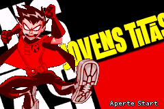
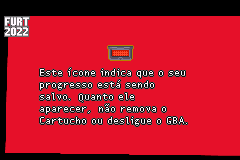
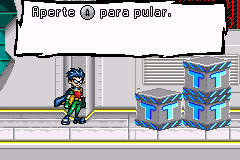
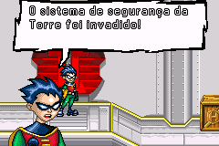
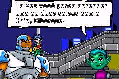

# Teen Titans

## Informações sobre o jogo

| Tipo | Informação |
| ----------- | ----------- |
| Nome | Teen Titans |
| Plataforma | [Game Boy Advance](../) |
| Desenvolvedora | Artificial Mind &amp; Movement |
| Distribuidora | Majesco Games |
| Gênero | Beat 'em up |
| Data de Lançamento | 11/10/2005 |

## Informações sobre a tradução

| Tipo | Informação |
| ----------- | ----------- |
| Versão | 0\.9 |
| Última versão | Sim |
| Data de Lançamento | 14/09/2022 |
| Percentual traduzido | 95% |

## Autores

| Autor(a) | Papel na tradução |
| ----------- | ----------- |
| [Denim](../../../autores/denim/) | Romhacking |
| [Breno](../../../autores/breno/) | Tradução e Gráficos |

## Informações sobre patching

| Aplicar o patch no arquivo | CRC32 Hash | MD5 Hash |
| ----------- | ----------- | ----------- |
| Teen Titans \(USA\) \(En,Fr\)\.gba | 12A0442C | 148C4190C830886BECE41EB380EA3533 |

## Páginas sobre a tradução

| URL | Oficial (publicado pelos autores) | Possuí link de download |
| ----------- | ----------- | ----------- |
| [https://www.romhacking.net.br/index.php?topic=2202](https://www.romhacking.net.br/index.php?topic=2202) | Sim | Sim, porém é necessário realizar login |
| [https://joao13traducoes.com/2022/09/gba-teen-titans-breno-e-denim/](https://joao13traducoes.com/2022/09/gba-teen-titans-breno-e-denim/) | Não | Sim, porém o arquivo ou página de download exige uma senha |

## Imagens da tradução

