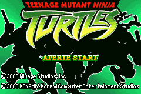
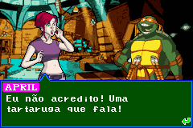
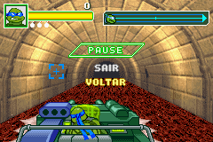

# Teenage Mutant Ninja Turtles

## Informações sobre o jogo

| Tipo | Informação |
| ----------- | ----------- |
| Nome | Teenage Mutant Ninja Turtles |
| Plataforma | [Game Boy Advance](../) |
| Desenvolvedora | Konami |
| Distribuidora | Konami |
| Gênero | Beat 'em up |
| Data de Lançamento | 21/10/2003 |

## Informações sobre a tradução

| Tipo | Informação |
| ----------- | ----------- |
| Versão | 1\.0 |
| Última versão | Sim |
| Data de Lançamento | (Provavelmente) 05/03/2005 |
| Percentual traduzido | None% |

## Autores

| Autor(a) | Papel na tradução |
| ----------- | ----------- |
| [Welblade](../../../autores/welblade/) | Completo |

## Grupos

* [Made In Brasil \(MIB\)](../../../grupos/made-in-brasil-mib/)

## Informações sobre patching

| Aplicar o patch no arquivo | CRC32 Hash | MD5 Hash |
| ----------- | ----------- | ----------- |
| Teenage Mutant Ninja Turtles \(U\)\.gba | F6C36783 | 660B52E20C76807F03BB97BF49E15AA1 |

## Páginas sobre a tradução

| URL | Oficial (publicado pelos autores) | Possuí link de download |
| ----------- | ----------- | ----------- |
| [https://romhackers.org/traducoes/portatil/game-boy-advance/teenage-mutant-ninja-turtles-central-mib/](https://romhackers.org/traducoes/portatil/game-boy-advance/teenage-mutant-ninja-turtles-central-mib/) | Não | Sim |
| [https://www.zophar.net/translations/gameboy-advance/brazilian-portuguese/teenage-mutant-ninja-turtles.html](https://www.zophar.net/translations/gameboy-advance/brazilian-portuguese/teenage-mutant-ninja-turtles.html) | Não | Sim |

## Imagens da tradução

