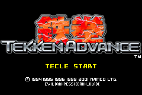
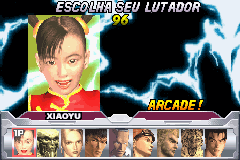
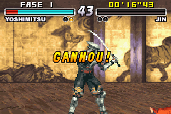

# Tekken Advance

## Informações sobre o jogo

| Tipo | Informação |
| ----------- | ----------- |
| Nome | Tekken Advance |
| Plataforma | [Game Boy Advance](../) |
| Desenvolvedora | NAMCO |
| Distribuidora | NAMCO |
| Gênero | Luta |
| Data de Lançamento | 21/12/2001 |

## Informações sobre a tradução

| Tipo | Informação |
| ----------- | ----------- |
| Última versão | Sim |
| Data de Lançamento | (Provavelmente) 31/01/2002 |
| Percentual traduzido | 98% |

## Autores

| Autor(a) | Papel na tradução |
| ----------- | ----------- |
| [Dark\_Blade](../../../autores/dark_blade/) | Completo |

## Grupos

* [Evil Darkness](../../../grupos/evil-darkness/)

## Informações sobre patching

| Aplicar o patch no arquivo | CRC32 Hash | MD5 Hash |
| ----------- | ----------- | ----------- |
| Tekken Advance \(J\) \[\!\]\.gba | C2EEAE53 | A5968BC058EA60A1E389BCD9306D9C7D |

## Páginas sobre a tradução

| URL | Oficial (publicado pelos autores) | Possuí link de download |
| ----------- | ----------- | ----------- |
| [https://romhackers.org/traducoes/portatil/game-boy-advance/tekken-advance-evil-darkness/](https://romhackers.org/traducoes/portatil/game-boy-advance/tekken-advance-evil-darkness/) | Não | Sim |
| [https://www.zophar.net/translations/gameboy-advance/brazilian-portuguese/tekken-advance.html](https://www.zophar.net/translations/gameboy-advance/brazilian-portuguese/tekken-advance.html) | Não | Sim |

## Imagens da tradução

