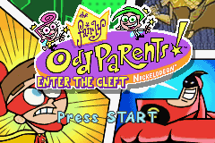
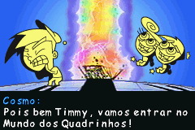
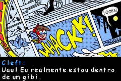

# The Fairly Odd Parents! Enter the Cleft

## Informações sobre o jogo

| Tipo | Informação |
| ----------- | ----------- |
| Nome | The Fairly Odd Parents\! Enter the Cleft |
| Plataforma | [Game Boy Advance](../) |
| Desenvolvedora | Altron |
| Distribuidora | THQ |
| Gênero | Ação / Plataforma |
| Data de Lançamento | (Por volta de) ??/??/2002 |

## Informações sobre a tradução

| Tipo | Informação |
| ----------- | ----------- |
| Última versão | Sim |
| Data de Lançamento | 01/05/2009 |
| Percentual traduzido | 100% |

## Autores

| Autor(a) | Papel na tradução |
| ----------- | ----------- |
| [Zyre](../../../autores/zyre/) | Completo |

## Grupos

* [Masters Games](../../../grupos/masters-games/)

## Informações sobre patching

| Aplicar o patch no arquivo | CRC32 Hash | MD5 Hash |
| ----------- | ----------- | ----------- |
| Fairly OddParents\!, The \- Enter the Cleft \(U\)\.gba | B0533F41 | E4AC9D76D7153C94919CE5A73DC984A4 |

## Páginas sobre a tradução

| URL | Oficial (publicado pelos autores) | Possuí link de download |
| ----------- | ----------- | ----------- |
| [https://romhackers.org/traducoes/portatil/game-boy-advance/the-fairly-odd-parents-enter-the-cleft-masters-games/](https://romhackers.org/traducoes/portatil/game-boy-advance/the-fairly-odd-parents-enter-the-cleft-masters-games/) | Não | Sim |
| [https://www.zophar.net/translations/gameboy-advance/brazilian-portuguese/the-fairly-odd-parents-enter-the-cleft.html](https://www.zophar.net/translations/gameboy-advance/brazilian-portuguese/the-fairly-odd-parents-enter-the-cleft.html) | Não | Sim |

## Imagens da tradução

