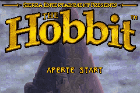
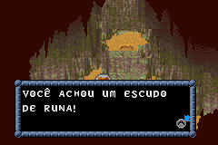
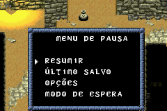

# The Hobbit

## Informações sobre o jogo

| Tipo | Informação |
| ----------- | ----------- |
| Nome | The Hobbit |
| Plataforma | [Game Boy Advance](../) |
| Desenvolvedora | Saffire |
| Distribuidora | Vivendi Games |
| Gênero | RPG / Ação |
| Data de Lançamento | 11/11/2003 |

## Informações sobre a tradução

| Tipo | Informação |
| ----------- | ----------- |
| Última versão | Sim |
| Data de Lançamento | (Provavelmente) 17/08/2004 |
| Percentual traduzido | None% |

## Autores

| Autor(a) | Papel na tradução |
| ----------- | ----------- |
| [Noko](../../../autores/noko/) | Completo |

## Grupos

* [Fox\-Roms](../../../grupos/fox-roms/)

## Informações sobre patching

| Aplicar o patch no arquivo | CRC32 Hash | MD5 Hash |
| ----------- | ----------- | ----------- |
| Hobbit, The \(U\)\.gba | D3F654B3 | 03AAA67FCB972EC6BCE6F1C6863026DA |

## Páginas sobre a tradução

| URL | Oficial (publicado pelos autores) | Possuí link de download |
| ----------- | ----------- | ----------- |
| [https://romhackers.org/traducoes/portatil/game-boy-advance/the-hobbit-fox-roms/](https://romhackers.org/traducoes/portatil/game-boy-advance/the-hobbit-fox-roms/) | Não | Sim |
| [https://www.zophar.net/translations/gameboy-advance/brazilian-portuguese/the-hobbit.html](https://www.zophar.net/translations/gameboy-advance/brazilian-portuguese/the-hobbit.html) | Não | Sim |

## Imagens da tradução

