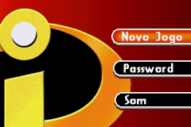
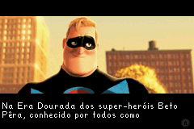
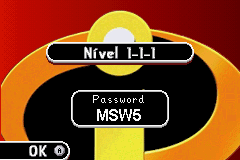
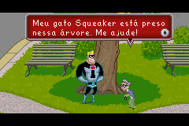
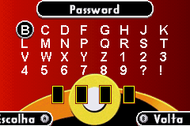
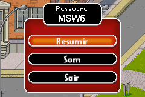

# The Incredibles

## Informações sobre o jogo

| Tipo | Informação |
| ----------- | ----------- |
| Nome | The Incredibles |
| Plataforma | [Game Boy Advance](../) |
| Desenvolvedora | helixe |
| Distribuidora | THQ |
| Gênero | Beat 'em up |
| Data de Lançamento | 31/10/2004 |

## Informações sobre a tradução

| Tipo | Informação |
| ----------- | ----------- |
| Versão | 1\.1 |
| Última versão | Sim |
| Data de Lançamento | 11/10/2005 |
| Percentual traduzido | None% |

## Autores

| Autor(a) | Papel na tradução |
| ----------- | ----------- |
| [Merlim](../../../autores/merlim/) | Completo |

## Grupos

* [Tradu\-GameX](../../../grupos/tradu-gamex/)

## Informações sobre patching

| Aplicar o patch no arquivo | CRC32 Hash | MD5 Hash |
| ----------- | ----------- | ----------- |
| Incredibles, The \(U\)\.gba | 194D5F6C | 97CC2AEB06142AEDC38B672E90E04A11 |

## Páginas sobre a tradução

| URL | Oficial (publicado pelos autores) | Possuí link de download |
| ----------- | ----------- | ----------- |
| [https://romhackers.org/traducoes/portatil/game-boy-advance/the-incredibles-tradu-gamex/](https://romhackers.org/traducoes/portatil/game-boy-advance/the-incredibles-tradu-gamex/) | Não | Sim |
| [https://www.zophar.net/translations/gameboy-advance/brazilian-portuguese/the-incredibles.html](https://www.zophar.net/translations/gameboy-advance/brazilian-portuguese/the-incredibles.html) | Não | Sim |

## Imagens da tradução

