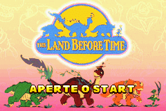
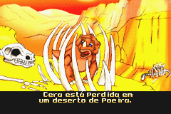
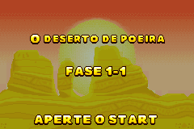

# The Land Before Time

## Informações sobre o jogo

| Tipo | Informação |
| ----------- | ----------- |
| Nome | The Land Before Time |
| Plataforma | [Game Boy Advance](../) |
| Desenvolvedora | Full Fat |
| Distribuidora | Conspiracy Entertainment |
| Gênero | Ação / Plataforma |
| Data de Lançamento | 01/03/2002 |

## Informações sobre a tradução

| Tipo | Informação |
| ----------- | ----------- |
| Versão | 1\.0 |
| Última versão | Sim |
| Data de Lançamento | 25/02/2003 |
| Percentual traduzido | None% |

## Autores

| Autor(a) | Papel na tradução |
| ----------- | ----------- |
| [Guto](../../../autores/guto/) | Completo |

## Grupos

* [EmuBrazil](../../../grupos/emubrazil/)

## Informações sobre patching

| Aplicar o patch no arquivo | CRC32 Hash | MD5 Hash |
| ----------- | ----------- | ----------- |
| Land Before Time, The \(E\) \(M5\) \[\!\]\.gba | CF0FA4D9 | F6D3840D1E185CB4829E8E9A9818D00D |

## Páginas sobre a tradução

| URL | Oficial (publicado pelos autores) | Possuí link de download |
| ----------- | ----------- | ----------- |
| [https://romhackers.org/traducoes/portatil/game-boy-advance/the-land-before-time-emubrazil/](https://romhackers.org/traducoes/portatil/game-boy-advance/the-land-before-time-emubrazil/) | Não | Sim |
| [https://www.zophar.net/translations/gameboy-advance/brazilian-portuguese/the-land-before-time.html](https://www.zophar.net/translations/gameboy-advance/brazilian-portuguese/the-land-before-time.html) | Não | Sim |

## Imagens da tradução

