# The Legend of Zelda - A Link to the Past &amp; Four Swords

## Informações sobre o jogo

| Tipo | Informação |
| ----------- | ----------- |
| Nome | The Legend of Zelda \- A Link to the Past &amp; Four Swords |
| Plataforma | [Game Boy Advance](../) |
| Desenvolvedora | Nintendo |
| Distribuidora | Nintendo |
| Gênero | RPG / Ação |
| Data de Lançamento | 03/12/2002 |

## Informações sobre a tradução

| Tipo | Informação |
| ----------- | ----------- |
| Versão | 3\.1 |
| Última versão | Sim |
| Data de Lançamento | 30/12/2022 |
| Percentual traduzido | 98% |

## Autores

| Autor(a) | Papel na tradução |
| ----------- | ----------- |
| [DiegoHH](../../../autores/diegohh/) | Romhacking e Gráficos |
| [Joapeer](../../../autores/joapeer/) | Romhacking |
| [Chapolink](../../../autores/chapolink/) | Tradução |
| [Galada](../../../autores/galada/) | Tradução |
| [Hageshii](../../../autores/hageshii/) | Tradução |
| [Twero](../../../autores/twero/) | Tradução |
| [Solid\_One](../../../autores/solid_one/) | Completo |
| [Aero](../../../autores/aero/) | Revisão |
| [Ninja](../../../autores/ninja/) | Revisão |
| [Hareon](../../../autores/hareon/) | Revisão |
| [spyblack](../../../autores/spyblack/) | Gráficos |

## Grupos

* [Trans\-Center](../../../grupos/trans-center/)
* [Monkey's Traduções](../../../grupos/monkeys-traducoes/)
* [Heroes of Time](../../../grupos/heroes-of-time/)
* [Hyrule Legends](../../../grupos/hyrule-legends/)
* [FUT](../../../grupos/fut/)

## Informações sobre patching

| Formato do patch | Aplicar o patch no arquivo | CRC32 Hash | MD5 Hash |
| ----------- | ----------- | ----------- | ----------- |
| IPS | Legend of Zelda, The \- A Link to the Past &amp; Four Swords \(U\)\.gba | 8E91CD13 | 3287CA66E5CC285A9FE3A922051E84C6 |

## Páginas sobre a tradução

| URL | Oficial (publicado pelos autores) | Possuí link de download |
| ----------- | ----------- | ----------- |
| [https://www.romhacking.net.br/index.php?topic=2287](https://www.romhacking.net.br/index.php?topic=2287) | Sim | Sim, porém é necessário realizar login |
| [https://www.romhacking.net/translations/5277/](https://www.romhacking.net/translations/5277/) | Não | Sim |
| [https://romhackers.org/traducoes/portatil/game-boy-advance/the-legend-of-zelda:-a-link-to-the-past-and-four-swords-hyrule-legends-monkeys-traducoes-e-trans-center/](https://romhackers.org/traducoes/portatil/game-boy-advance/the-legend-of-zelda:-a-link-to-the-past-and-four-swords-hyrule-legends-monkeys-traducoes-e-trans-center/) | Não | Não |
| [https://joao13traducoes.com/2018/03/gba-legend-of-zelda-link-to-past-and-four-swords-hyrule-legends-monkeys-traducoes-e-trans-center/](https://joao13traducoes.com/2018/03/gba-legend-of-zelda-link-to-past-and-four-swords-hyrule-legends-monkeys-traducoes-e-trans-center/) | Não | Sim, porém o arquivo ou página de download exige uma senha |

## Imagens da tradução

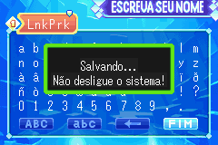
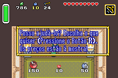
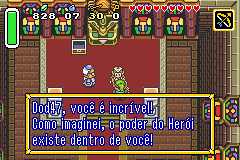
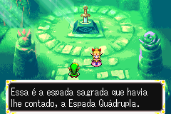
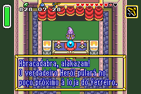
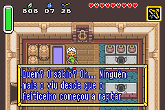
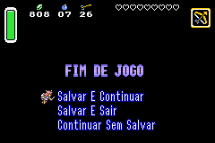
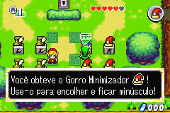
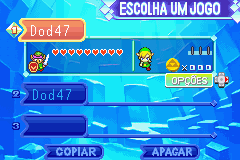
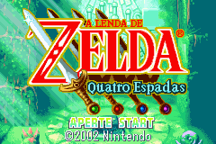
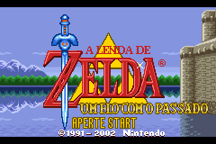
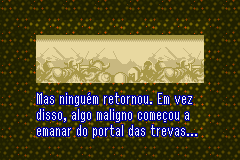
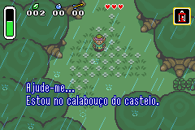
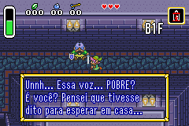

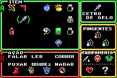