# The Legend of Zelda - The Minish Cap

## Informações sobre o jogo

| Tipo | Informação |
| ----------- | ----------- |
| Nome | The Legend of Zelda \- The Minish Cap |
| Plataforma | [Game Boy Advance](../) |
| Desenvolvedora | Flagship |
| Distribuidora | Nintendo |
| Gênero | RPG / Ação |
| Data de Lançamento | (Por volta de) ??/??/2005 |

## Informações sobre a tradução

| Tipo | Informação |
| ----------- | ----------- |
| Versão | 1\.0 |
| Última versão | Sim |
| Data de Lançamento | 30/12/2022 |
| Percentual traduzido | 100% |

## Autores

| Autor(a) | Papel na tradução |
| ----------- | ----------- |
| [Kmikz](../../../autores/kmikz/) | Completo |
| [Fallen\_Soul](../../../autores/fallen_soul/) | Romhacking |
| [KusanagiSama](../../../autores/kusanagisama/) | Tradução e revisão |
| [Merlim](../../../autores/merlim/) | Tradução e revisão |
| [Solid\_One](../../../autores/solid_one/) | Completo |
| [Dank](../../../autores/dank/) | Tradução |
| [Aloprado](../../../autores/aloprado/) | Tradução |
| [Joapeer](../../../autores/joapeer/) | Completo |
| [Odin](../../../autores/odin/) | Revisão |
| [Magall](../../../autores/magall/) | Tradução e revisão |
| [Hareon](../../../autores/hareon/) | Revisão |

## Grupos

* [Trans\-Center](../../../grupos/trans-center/)
* [PO\.B\.R\.E](../../../grupos/pobre/)
* [Heroes of Time](../../../grupos/heroes-of-time/)
* [Projeto BR](../../../grupos/projeto-br/)

## Informações sobre patching

| Aplicar o patch no arquivo | CRC32 Hash | MD5 Hash |
| ----------- | ----------- | ----------- |
| Legend of Zelda, The \- The Minish Cap \(U\)\.gba | ABCEBBB1 | A104896DA0047ABE8BEE2A6E3F4C7290 |

## Páginas sobre a tradução

| URL | Oficial (publicado pelos autores) | Possuí link de download |
| ----------- | ----------- | ----------- |
| [https://www.romhacking.net/translations/5249/](https://www.romhacking.net/translations/5249/) | Sim | Sim |
| [https://www.e4t.com.br/downloads/a-lenda-de-zelda-o-gorro-minimizador/](https://www.e4t.com.br/downloads/a-lenda-de-zelda-o-gorro-minimizador/) | Sim | Sim |
| [https://www.romhacking.net.br/index.php?topic=2288](https://www.romhacking.net.br/index.php?topic=2288) | Sim | Sim, porém é necessário realizar login |
| [https://www.zophar.net/translations/gameboy-advance/brazilian-portuguese/the-legend-of-zelda-the-minish-cap.html](https://www.zophar.net/translations/gameboy-advance/brazilian-portuguese/the-legend-of-zelda-the-minish-cap.html) | Não | Sim |
| [https://romhackers.org/traducoes/portatil/game-boy-advance/the-legend-of-zelda-the-minish-cap-trans-center-po.b.r.e.-e-projeto-br/](https://romhackers.org/traducoes/portatil/game-boy-advance/the-legend-of-zelda-the-minish-cap-trans-center-po.b.r.e.-e-projeto-br/) | Não | Não |
| [https://joao13traducoes.com/2018/03/gba-legend-of-zelda-minish-cap-heroes-of-time-trans-center-pobre-e-projeto-br/](https://joao13traducoes.com/2018/03/gba-legend-of-zelda-minish-cap-heroes-of-time-trans-center-pobre-e-projeto-br/) | Não | Sim, porém o arquivo ou página de download exige uma senha |

## Imagens da tradução

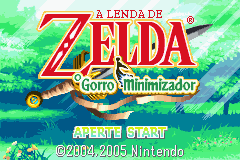
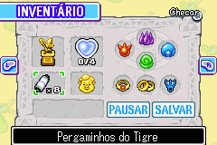
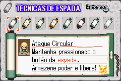
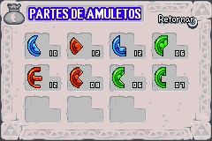
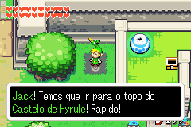
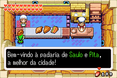
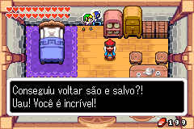
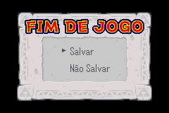
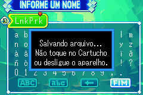
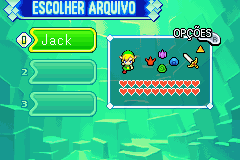
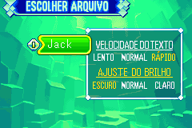
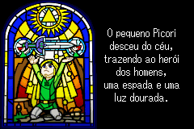
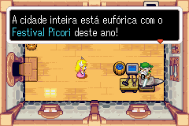
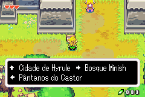
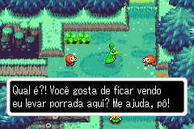
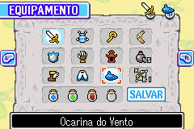