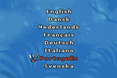
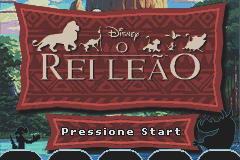
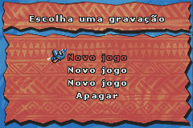
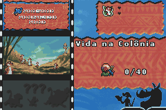
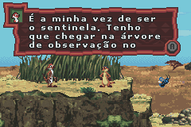
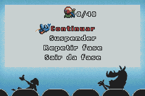

# The Lion King

## Informações sobre o jogo

| Tipo | Informação |
| ----------- | ----------- |
| Nome | The Lion King |
| Plataforma | [Game Boy Advance](../) |
| Desenvolvedora | Vicarious Visions |
| Distribuidora | THQ |
| Gênero | Ação / Plataforma |
| Data de Lançamento | (Por volta de) ??/??/2003 |

## Informações sobre a tradução

| Tipo | Informação |
| ----------- | ----------- |
| Última versão | Sim |
| Data de Lançamento | 15/08/2020 |
| Percentual traduzido | 100% |

## Autores

| Autor(a) | Papel na tradução |
| ----------- | ----------- |
| [Breno](../../../autores/breno/) | Tradução |
| [Kosmus](../../../autores/kosmus/) | Tradução |
| [Denim](../../../autores/denim/) | Gráficos |

## Informações sobre patching

| Formato do patch | Aplicar o patch no arquivo | CRC32 Hash | MD5 Hash |
| ----------- | ----------- | ----------- | ----------- |
| IPS | Lion King, The \(E\) \(M8\)\.gba | 63592451 | 3F1CB5398649FF0C43673E73CAD3010E |

## Páginas sobre a tradução

| URL | Oficial (publicado pelos autores) | Possuí link de download |
| ----------- | ----------- | ----------- |
| [https://www.romhacking.net.br/index.php?topic=1577](https://www.romhacking.net.br/index.php?topic=1577) | Não | Sim |
| [https://joao13traducoes.com/2020/08/gba-disney-lion-king-breno-kosmus-e-denim/](https://joao13traducoes.com/2020/08/gba-disney-lion-king-breno-kosmus-e-denim/) | Não | Sim, porém o arquivo ou página de download exige uma senha |

## Imagens da tradução

