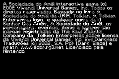
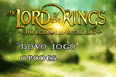
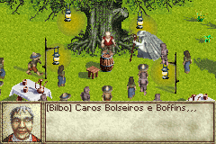
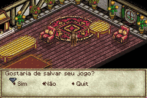
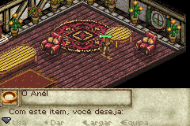

# The Lord of The Rings - The Fellowship of The Ring

## Informações sobre o jogo

| Tipo | Informação |
| ----------- | ----------- |
| Nome | The Lord of The Rings \- The Fellowship of The Ring |
| Plataforma | [Game Boy Advance](../) |
| Desenvolvedora | Pocket Studios |
| Distribuidora | Vivendi Games |
| Gênero | RPG / Ação |
| Data de Lançamento | 24/09/2002 |

## Informações sobre a tradução

| Tipo | Informação |
| ----------- | ----------- |
| Versão | 1\.1b |
| Última versão | Sim |
| Data de Lançamento | (Provavelmente) 11/01/2003 |
| Percentual traduzido | None% |

## Autores

| Autor(a) | Papel na tradução |
| ----------- | ----------- |
| [Dark\_Blade](../../../autores/dark_blade/) | Completo |
| [\_Wrath\_](../../../autores/wrath/) | Tradução |

## Grupos

* [Evil Darkness](../../../grupos/evil-darkness/)

## Informações sobre patching

| Aplicar o patch no arquivo | CRC32 Hash | MD5 Hash |
| ----------- | ----------- | ----------- |
| Lord of the Rings, The \- The Fellowship of the Ring \(U\)\.gba | EE0C58BC | 644712A277E801997624CECE31B661A9 |

## Páginas sobre a tradução

| URL | Oficial (publicado pelos autores) | Possuí link de download |
| ----------- | ----------- | ----------- |
| [https://romhackers.org/traducoes/portatil/game-boy-advance/the-lord-of-the-rings-the-fellowship-of-the-ring-evil-darkness/](https://romhackers.org/traducoes/portatil/game-boy-advance/the-lord-of-the-rings-the-fellowship-of-the-ring-evil-darkness/) | Não | Sim |
| [https://www.zophar.net/translations/gameboy-advance/brazilian-portuguese/the-lord-of-the-rings-the-fellowship-of-the-ring.html](https://www.zophar.net/translations/gameboy-advance/brazilian-portuguese/the-lord-of-the-rings-the-fellowship-of-the-ring.html) | Não | Sim |

## Imagens da tradução

