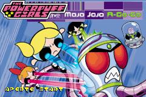
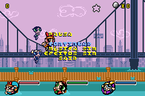

# The Powerpuff Girls - Mojo Jojo-A-Go-Go

## Informações sobre o jogo

| Tipo | Informação |
| ----------- | ----------- |
| Nome | The Powerpuff Girls \- Mojo Jojo\-A\-Go\-Go |
| Plataforma | [Game Boy Advance](../) |
| Desenvolvedora | Sennari Interactive |
| Distribuidora | BAM! Entertainment |
| Gênero | Shoot 'em up |
| Data de Lançamento | 16/11/2001 |

## Informações sobre a tradução

| Tipo | Informação |
| ----------- | ----------- |
| Última versão | Sim |
| Data de Lançamento | 03/03/2002 |
| Percentual traduzido | 100% |

## Autores

| Autor(a) | Papel na tradução |
| ----------- | ----------- |
| [S\-NES](../../../autores/s-nes/) | Completo |

## Grupos

* [Tradu\-Roms](../../../grupos/tradu-roms/)

## Informações sobre patching

| Aplicar o patch no arquivo | CRC32 Hash | MD5 Hash |
| ----------- | ----------- | ----------- |
| Powerpuff Girls, The \- Mojo Jojo A\-Go\-Go\! \(U\) \(M6\)\.gba | DFB57DCF | 28A2B3E44952944E29A168E5F17B5696 |

## Páginas sobre a tradução

| URL | Oficial (publicado pelos autores) | Possuí link de download |
| ----------- | ----------- | ----------- |
| [https://traduroms.github.io/tr/tradus/menina.htm](https://traduroms.github.io/tr/tradus/menina.htm) | Sim | Sim |
| [https://www.zophar.net/translations/gameboy-advance/portuguese/powerpuff-girls-mojo-jojo-a-gogo.html](https://www.zophar.net/translations/gameboy-advance/portuguese/powerpuff-girls-mojo-jojo-a-gogo.html) | Não | Sim |
| [https://romhackers.org/traducoes/portatil/game-boy-advance/the-powerpuff-girls-mojo-jojo-a-go-go-tradu-roms/](https://romhackers.org/traducoes/portatil/game-boy-advance/the-powerpuff-girls-mojo-jojo-a-go-go-tradu-roms/) | Não | Não |

## Imagens da tradução

