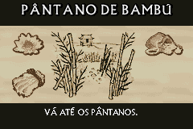
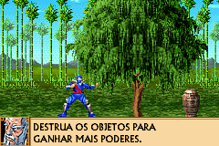

# The Revenge of Shinobi

## Informações sobre o jogo

| Tipo | Informação |
| ----------- | ----------- |
| Nome | The Revenge of Shinobi |
| Plataforma | [Game Boy Advance](../) |
| Desenvolvedora | 3d6 Games |
| Distribuidora | THQ |
| Gênero | Ação / Plataforma |
| Data de Lançamento | (Por volta de) ??/??/2002 |

## Informações sobre a tradução

| Tipo | Informação |
| ----------- | ----------- |
| Versão | 1\.0 |
| Última versão | Sim |
| Data de Lançamento | 27/02/2009 |
| Percentual traduzido | 100% |

## Autores

| Autor(a) | Papel na tradução |
| ----------- | ----------- |
| [ØX\-Carnage](../../../autores/x-carnage/) | Completo |

## Grupos

* [Monkey's Traduções](../../../grupos/monkeys-traducoes/)

## Informações sobre patching

| Aplicar o patch no arquivo | CRC32 Hash | MD5 Hash |
| ----------- | ----------- | ----------- |
| Revenge of Shinobi, The \(E\) \(M5\) \(Beta\)\.gba | 58A3F0E1 | 836C290E70DD96DB342B73D92B758B57 |

## Páginas sobre a tradução

| URL | Oficial (publicado pelos autores) | Possuí link de download |
| ----------- | ----------- | ----------- |
| [https://romhackers.org/traducoes/portatil/game-boy-advance/the-revenge-of-shinobi-monkeys-traducoes/](https://romhackers.org/traducoes/portatil/game-boy-advance/the-revenge-of-shinobi-monkeys-traducoes/) | Não | Sim |
| [https://www.zophar.net/translations/gameboy-advance/brazilian-portuguese/the-revenge-of-shinobi.html](https://www.zophar.net/translations/gameboy-advance/brazilian-portuguese/the-revenge-of-shinobi.html) | Não | Sim |

## Imagens da tradução

