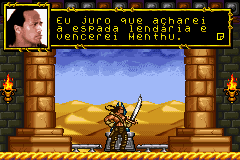
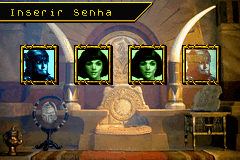

# The Scorpion King - Sword of Osiris

## Informações sobre o jogo

| Tipo | Informação |
| ----------- | ----------- |
| Nome | The Scorpion King \- Sword of Osiris |
| Plataforma | [Game Boy Advance](../) |
| Desenvolvedora | WayForward |
| Distribuidora | Universal Interactive |
| Gênero | Ação / Plataforma |
| Data de Lançamento | 31/03/2002 |

## Informações sobre a tradução

| Tipo | Informação |
| ----------- | ----------- |
| Versão | 1\.0 |
| Última versão | Sim |
| Data de Lançamento | 25/12/2011 |
| Percentual traduzido | 100% |

## Autores

| Autor(a) | Papel na tradução |
| ----------- | ----------- |
| [RDebossens](../../../autores/rdebossens/) | Completo |

## Informações sobre patching

| Aplicar o patch no arquivo | CRC32 Hash | MD5 Hash |
| ----------- | ----------- | ----------- |
| Scorpion King, The \- Sword of Osiris \(U\) \[\!\]\.gba | 6E0A8585 | 8620AEB89F00DD3E3C2A500BA75CE2DE |

## Páginas sobre a tradução

| URL | Oficial (publicado pelos autores) | Possuí link de download |
| ----------- | ----------- | ----------- |
| [https://romhackers.org/traducoes/portatil/game-boy-advance/the-scorpion-king-sword-of-osiris-rdebossens/](https://romhackers.org/traducoes/portatil/game-boy-advance/the-scorpion-king-sword-of-osiris-rdebossens/) | Não | Sim |

## Imagens da tradução

