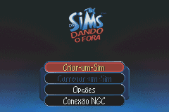
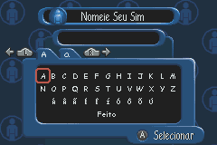
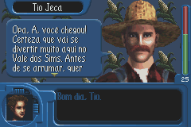

# The Sims - Bustin' Out

## Informações sobre o jogo

| Tipo | Informação |
| ----------- | ----------- |
| Nome | The Sims \- Bustin' Out |
| Plataforma | [Game Boy Advance](../) |
| Desenvolvedora | Maxis Software |
| Distribuidora | Electronic Arts (EA) |
| Gênero | Simulação |
| Data de Lançamento | 02/12/2003 |

## Informações sobre a tradução

| Tipo | Informação |
| ----------- | ----------- |
| Última versão | Sim |
| Data de Lançamento | 02/03/2021 |
| Percentual traduzido | 100% |

## Autores

| Autor(a) | Papel na tradução |
| ----------- | ----------- |
| [Kosmus](../../../autores/kosmus/) | Completo |
| [Vihhada](../../../autores/vihhada/) | Tradução e revisão |
| [Mat~](../../../autores/mat/) | Tradução |
| [Gamerulez](../../../autores/gamerulez/) | Tradução |
| [Denim](../../../autores/denim/) | Romhacking |
| [BMatSantos](../../../autores/bmatsantos/) | Tradução |
| [Dwlipey](../../../autores/dwlipey/) | Tradução |
| [Hareon](../../../autores/hareon/) | Tradução |
| [Kazuma](../../../autores/kazuma/) | Revisão |

## Informações sobre patching

| Aplicar o patch no arquivo | CRC32 Hash | MD5 Hash |
| ----------- | ----------- | ----------- |
| Sims, The \- Bustin' Out \(UE\) \(M6\)\.gba | ABAF519C | E429CE307FE06DBCD7724552FF0339D7 |

## Páginas sobre a tradução

| URL | Oficial (publicado pelos autores) | Possuí link de download |
| ----------- | ----------- | ----------- |
| [https://www.e4t.com.br/downloads/os-sims-dando-o-fora/](https://www.e4t.com.br/downloads/os-sims-dando-o-fora/) | Sim | Sim |
| [https://www.romhacking.net.br/index.php?topic=1782](https://www.romhacking.net.br/index.php?topic=1782) | Sim | Sim, porém é necessário realizar login |
| [https://joao13traducoes.com/2021/03/gba-sims-bustin-out-kosmus-e-cia/](https://joao13traducoes.com/2021/03/gba-sims-bustin-out-kosmus-e-cia/) | Não | Sim, porém o arquivo ou página de download exige uma senha |

## Imagens da tradução

