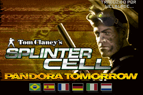
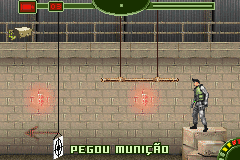
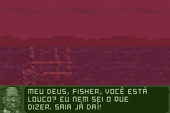

# Tom Clancy’s Splinter Cell - Pandora Tomorrow

## Informações sobre o jogo

| Tipo | Informação |
| ----------- | ----------- |
| Nome | Tom Clancy’s Splinter Cell \- Pandora Tomorrow |
| Plataforma | [Game Boy Advance](../) |
| Desenvolvedora | Ubisoft |
| Distribuidora | Ubisoft |
| Gênero | Stealth |
| Data de Lançamento | 26/03/2004 |

## Informações sobre a tradução

| Tipo | Informação |
| ----------- | ----------- |
| Versão | 1\.1 |
| Última versão | Sim |
| Data de Lançamento | (Provavelmente) 12/04/2005 |
| Percentual traduzido | 100% |

## Autores

| Autor(a) | Papel na tradução |
| ----------- | ----------- |
| [Welblade](../../../autores/welblade/) | Completo |

## Grupos

* [Made In Brasil \(MIB\)](../../../grupos/made-in-brasil-mib/)

## Informações sobre patching

| Aplicar o patch no arquivo | CRC32 Hash | MD5 Hash |
| ----------- | ----------- | ----------- |
| Tom Clancy’s Splinter Cell \- Pandora Tomorrow \(E\) \(M6\)\.gba | F007DFE1 | 5DD27560673DD339F43584F8301A7364 |

## Páginas sobre a tradução

| URL | Oficial (publicado pelos autores) | Possuí link de download |
| ----------- | ----------- | ----------- |
| [https://romhackers.org/traducoes/portatil/game-boy-advance/splinter-cell-pandora-tomorrow-central-mib/](https://romhackers.org/traducoes/portatil/game-boy-advance/splinter-cell-pandora-tomorrow-central-mib/) | Não | Sim |
| [https://www.zophar.net/translations/gameboy-advance/brazilian-portuguese/tom-clancy-s-splinter-cell-pandora-tomorrow.html](https://www.zophar.net/translations/gameboy-advance/brazilian-portuguese/tom-clancy-s-splinter-cell-pandora-tomorrow.html) | Não | Sim |

## Imagens da tradução

