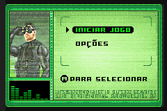
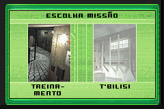
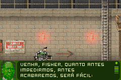
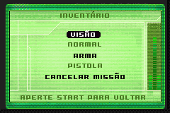
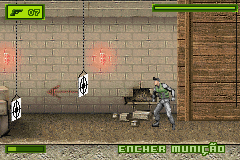
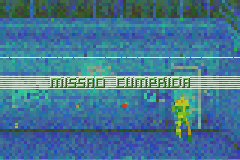
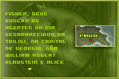
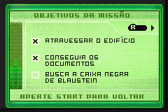

# Tom Clancy’s Splinter Cell

## Informações sobre o jogo

| Tipo | Informação |
| ----------- | ----------- |
| Nome | Tom Clancy’s Splinter Cell |
| Plataforma | [Game Boy Advance](../) |
| Desenvolvedora | Ubisoft |
| Distribuidora | Ubisoft |
| Gênero | Stealth |
| Data de Lançamento | 24/04/2003 |

## Informações sobre a tradução

| Tipo | Informação |
| ----------- | ----------- |
| Versão | 1\.0 |
| Última versão | Sim |
| Data de Lançamento | (Por volta de) ??/??/2003 |
| Percentual traduzido | 100% |

## Autores

| Autor(a) | Papel na tradução |
| ----------- | ----------- |
| [Mestre Splinter](../../../autores/mestre-splinter/) | Completo |

## Grupos

* [TransFac](../../../grupos/transfac/)

## Informações sobre patching

| Aplicar o patch no arquivo | CRC32 Hash | MD5 Hash |
| ----------- | ----------- | ----------- |
| Tom Clancy’s Splinter Cell \(U\) \(M3\)\.gba | DC32D153 | D1EBCAFB73E5160B0B3FD0C98F27456E |

## Páginas sobre a tradução

| URL | Oficial (publicado pelos autores) | Possuí link de download |
| ----------- | ----------- | ----------- |
| [https://romhackers.org/traducoes/portatil/game-boy-advance/splinter-cell-transfac/](https://romhackers.org/traducoes/portatil/game-boy-advance/splinter-cell-transfac/) | Não | Sim |
| [https://www.zophar.net/translations/gameboy-advance/brazilian-portuguese/tom-clancy-s-splinter-cell.html](https://www.zophar.net/translations/gameboy-advance/brazilian-portuguese/tom-clancy-s-splinter-cell.html) | Não | Sim |

## Imagens da tradução

