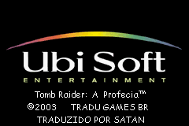
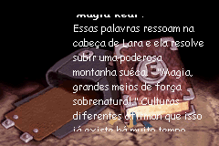
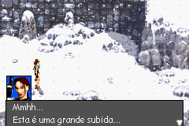
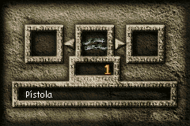

# Tomb Raider - The Prophecy

## Informações sobre o jogo

| Tipo | Informação |
| ----------- | ----------- |
| Nome | Tomb Raider \- The Prophecy |
| Plataforma | [Game Boy Advance](../) |
| Desenvolvedora | Ubisoft |
| Distribuidora | Ubisoft |
| Gênero | Ação / Aventura |
| Data de Lançamento | 15/11/2002 |

## Informações sobre a tradução

| Tipo | Informação |
| ----------- | ----------- |
| Última versão | Sim |
| Data de Lançamento | 18/04/2003 |
| Percentual traduzido | None% |

## Autores

| Autor(a) | Papel na tradução |
| ----------- | ----------- |
| [Satan](../../../autores/satan/) | Completo |

## Grupos

* [Tradu Games BR](../../../grupos/tradu-games-br/)

## Informações sobre patching

| Aplicar o patch no arquivo | CRC32 Hash | MD5 Hash |
| ----------- | ----------- | ----------- |
| Tomb Raider \- The Prophecy \(E\) \(M5\) \[hIRff\]\.gba | 4235FAC3 | 627FB1625974C4D04E9E38CED12795CE |

## Páginas sobre a tradução

| URL | Oficial (publicado pelos autores) | Possuí link de download |
| ----------- | ----------- | ----------- |
| [https://romhackers.org/traducoes/portatil/game-boy-advance/tomb-raider-the-prophecy-tradu-games-br/](https://romhackers.org/traducoes/portatil/game-boy-advance/tomb-raider-the-prophecy-tradu-games-br/) | Não | Sim |
| [https://www.zophar.net/translations/gameboy-advance/brazilian-portuguese/tomb-raider-the-prophecy.html](https://www.zophar.net/translations/gameboy-advance/brazilian-portuguese/tomb-raider-the-prophecy.html) | Não | Sim |

## Imagens da tradução

