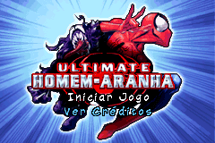
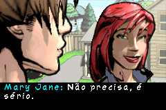
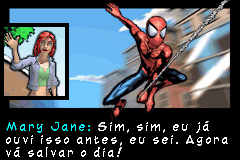
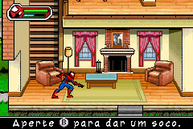

# Ultimate Spider-Man

## Informações sobre o jogo

| Tipo | Informação |
| ----------- | ----------- |
| Nome | Ultimate Spider\-Man |
| Plataforma | [Game Boy Advance](../) |
| Desenvolvedora | Vicarious Visions |
| Distribuidora | Activision |
| Gênero | Ação / Plataforma |
| Data de Lançamento | 19/09/2005 |

## Informações sobre a tradução

| Tipo | Informação |
| ----------- | ----------- |
| Versão | 1\.1 |
| Última versão | Sim |
| URL Youtube | https://www.youtube.com/watch?v=4tvDN4t07aE |
| Data de Lançamento | 15/11/2022 |
| Percentual traduzido | 100% |

## Autores

| Autor(a) | Papel na tradução |
| ----------- | ----------- |
| [Breno](../../../autores/breno/) | Completo |
| [Denim](../../../autores/denim/) | Gráficos |

## Informações sobre patching

| Aplicar o patch no arquivo | CRC32 Hash | MD5 Hash |
| ----------- | ----------- | ----------- |
| Ultimate Spider\-Man \(U\)\.gba | 931E2C18 | 11BEB7FD8CE6C8A3D4987274835E0843 |

## Páginas sobre a tradução

| URL | Oficial (publicado pelos autores) | Possuí link de download |
| ----------- | ----------- | ----------- |
| [https://www.romhacking.net.br/index.php?topic=1571](https://www.romhacking.net.br/index.php?topic=1571) | Sim | Sim |
| [https://www.romhacking.net/translations/6715/](https://www.romhacking.net/translations/6715/) | Sim | Sim |
| [https://joao13traducoes.com/2020/08/gba-ultimate-spider-man-breno/](https://joao13traducoes.com/2020/08/gba-ultimate-spider-man-breno/) | Não | Sim, porém o arquivo ou página de download exige uma senha |

## Imagens da tradução

