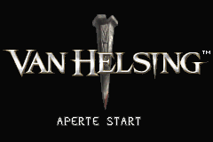
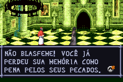
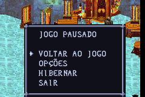

# Van Helsing

## Informações sobre o jogo

| Tipo | Informação |
| ----------- | ----------- |
| Nome | Van Helsing |
| Plataforma | [Game Boy Advance](../) |
| Desenvolvedora | Saffire |
| Distribuidora | Vivendi Games |
| Gênero | Ação |
| Data de Lançamento | 14/05/2004 |

## Informações sobre a tradução

| Tipo | Informação |
| ----------- | ----------- |
| Versão | 1\.2 |
| Última versão | Sim |
| Data de Lançamento | (Provavelmente) 26/03/2006 |
| Percentual traduzido | 100% |

## Autores

| Autor(a) | Papel na tradução |
| ----------- | ----------- |
| [Kmikz](../../../autores/kmikz/) | Completo |

## Grupos

* [Trans\-Center](../../../grupos/trans-center/)

## Informações sobre patching

| Aplicar o patch no arquivo | CRC32 Hash | MD5 Hash |
| ----------- | ----------- | ----------- |
| Van Helsing \(U\)\.gba | 36159D63 | 1CF89B423893A12EE0BBC1C4E2868509 |

## Páginas sobre a tradução

| URL | Oficial (publicado pelos autores) | Possuí link de download |
| ----------- | ----------- | ----------- |
| [https://romhackers.org/traducoes/portatil/game-boy-advance/van-helsing-trans-center/](https://romhackers.org/traducoes/portatil/game-boy-advance/van-helsing-trans-center/) | Não | Sim |
| [https://www.zophar.net/translations/gameboy-advance/brazilian-portuguese/van-helsing-cqc.html](https://www.zophar.net/translations/gameboy-advance/brazilian-portuguese/van-helsing-cqc.html) | Não | Sim |

## Imagens da tradução

