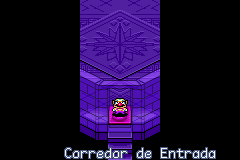

# Wario Land 4

## Informações sobre o jogo

| Tipo | Informação |
| ----------- | ----------- |
| Nome | Wario Land 4 |
| Plataforma | [Game Boy Advance](../) |
| Desenvolvedora | Nintendo |
| Distribuidora | Nintendo |
| Gênero | Ação / Plataforma |
| Data de Lançamento | 16/11/2001 |

## Informações sobre a tradução

| Tipo | Informação |
| ----------- | ----------- |
| Versão | 1\.0 |
| Última versão | Sim |
| Data de Lançamento | 03/11/2014 |
| Percentual traduzido | 90% |

## Autores

| Autor(a) | Papel na tradução |
| ----------- | ----------- |
| [Merlim](../../../autores/merlim/) | Completo |

## Grupos

* [Trans\-Center](../../../grupos/trans-center/)

## Informações sobre patching

| Aplicar o patch no arquivo | CRC32 Hash | MD5 Hash |
| ----------- | ----------- | ----------- |
| Wario Land 4 \(E\)\(Mode7\)\.gba | 89F7FBBD | 6969B418E0CE9079A2D4B3F29DE81003 |

## Páginas sobre a tradução

| URL | Oficial (publicado pelos autores) | Possuí link de download |
| ----------- | ----------- | ----------- |
| [https://romhackers.org/traducoes/portatil/game-boy-advance/wario-land-4-trans-center/](https://romhackers.org/traducoes/portatil/game-boy-advance/wario-land-4-trans-center/) | Não | Sim |

## Imagens da tradução

