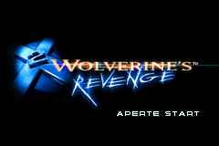

# X-Men 2 - Wolverine’s Revenge

## Informações sobre o jogo

| Tipo | Informação |
| ----------- | ----------- |
| Nome | X\-Men 2 \- Wolverine’s Revenge |
| Plataforma | [Game Boy Advance](../) |
| Desenvolvedora | Vicarious Visions |
| Distribuidora | Activision |
| Gênero | Beat 'em up |
| Data de Lançamento | 13/04/2003 |

## Informações sobre a tradução

| Tipo | Informação |
| ----------- | ----------- |
| Versão | 1\.0 |
| Última versão | Sim |
| Data de Lançamento | (Provavelmente) 11/07/2003 |
| Percentual traduzido | 100% |

## Autores

| Autor(a) | Papel na tradução |
| ----------- | ----------- |
| [Ninho](../../../autores/ninho/) | Completo |
| [Maluckets](../../../autores/maluckets/) | Revisão |

## Grupos

* [Trans\-Center](../../../grupos/trans-center/)

## Informações sobre patching

| Aplicar o patch no arquivo | CRC32 Hash | MD5 Hash |
| ----------- | ----------- | ----------- |
| X\-Men 2 \- Wolverine’s Revenge \(U\)\.gba | 41A92220 | 69662D33F665B2E00E4F95AA75B16A6A |

## Páginas sobre a tradução

| URL | Oficial (publicado pelos autores) | Possuí link de download |
| ----------- | ----------- | ----------- |
| [https://romhackers.org/traducoes/portatil/game-boy-advance/x2-wolverines-revenge-trans-center/](https://romhackers.org/traducoes/portatil/game-boy-advance/x2-wolverines-revenge-trans-center/) | Não | Sim |
| [https://www.zophar.net/translations/gameboy-advance/brazilian-portuguese/x-men-2-wolverine-s-revenge.html](https://www.zophar.net/translations/gameboy-advance/brazilian-portuguese/x-men-2-wolverine-s-revenge.html) | Não | Sim |

## Imagens da tradução

