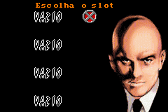
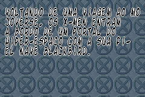
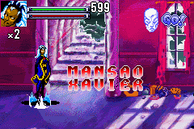
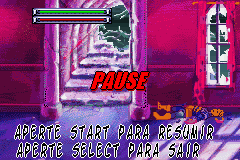
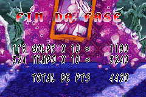
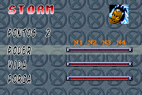

# X-Men - Reign of Apocalypse

## Informações sobre o jogo

| Tipo | Informação |
| ----------- | ----------- |
| Nome | X\-Men \- Reign of Apocalypse |
| Plataforma | [Game Boy Advance](../) |
| Desenvolvedora | Digital Eclipse Software |
| Distribuidora | Activision |
| Gênero | Beat 'em up |
| Data de Lançamento | 25/09/2001 |

## Informações sobre a tradução

| Tipo | Informação |
| ----------- | ----------- |
| Última versão | Sim |
| Data de Lançamento | 11/09/2002 |
| Percentual traduzido | None% |

## Autores

| Autor(a) | Papel na tradução |
| ----------- | ----------- |
| [Le0nardu](../../../autores/le0nardu/) | Completo |

## Grupos

* [Made In Brasil \(MIB\)](../../../grupos/made-in-brasil-mib/)

## Informações sobre patching

| Aplicar o patch no arquivo | CRC32 Hash | MD5 Hash |
| ----------- | ----------- | ----------- |
| X\-Men \- Reign of Apocalypse \(U\) \[\!\]\.gba | 25F43491 | 9457A51730ADA0EA9CCDBAAB51D93613 |

## Páginas sobre a tradução

| URL | Oficial (publicado pelos autores) | Possuí link de download |
| ----------- | ----------- | ----------- |
| [https://romhackers.org/traducoes/portatil/game-boy-advance/x-men-reign-of-apocalypse-mib/](https://romhackers.org/traducoes/portatil/game-boy-advance/x-men-reign-of-apocalypse-mib/) | Não | Sim |
| [https://www.zophar.net/translations/gameboy-advance/brazilian-portuguese/x-men-reign-of-apocalypse.html](https://www.zophar.net/translations/gameboy-advance/brazilian-portuguese/x-men-reign-of-apocalypse.html) | Não | Sim |

## Imagens da tradução

