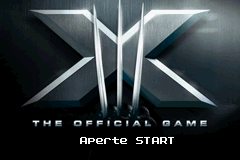
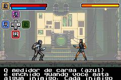
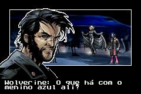

# X-Men - The Official Game

## Informações sobre o jogo

| Tipo | Informação |
| ----------- | ----------- |
| Nome | X\-Men \- The Official Game |
| Plataforma | [Game Boy Advance](../) |
| Desenvolvedora | WayForward |
| Distribuidora | Activision |
| Gênero | Ação / Plataforma |
| Data de Lançamento | 16/05/2006 |

## Informações sobre a tradução

| Tipo | Informação |
| ----------- | ----------- |
| Versão | 1\.0 |
| Última versão | Sim |
| Data de Lançamento | (Provavelmente) 21/06/2006 |
| Percentual traduzido | 100% |

## Autores

| Autor(a) | Papel na tradução |
| ----------- | ----------- |
| [ØX\-Carnage](../../../autores/x-carnage/) | Completo |

## Grupos

* [Central de Traduções](../../../grupos/central-de-traducoes/)

## Informações sobre patching

| Aplicar o patch no arquivo | CRC32 Hash | MD5 Hash |
| ----------- | ----------- | ----------- |
| X\-Men \- The Official Game \(U\)\.gba | C87F460A | 2584C4D9C73888FFC9096A02FAFEA08C |

## Páginas sobre a tradução

| URL | Oficial (publicado pelos autores) | Possuí link de download |
| ----------- | ----------- | ----------- |
| [https://romhackers.org/traducoes/portatil/game-boy-advance/x-men-the-official-game-central-de-traducoes/](https://romhackers.org/traducoes/portatil/game-boy-advance/x-men-the-official-game-central-de-traducoes/) | Não | Sim |
| [https://www.zophar.net/translations/gameboy-advance/brazilian-portuguese/x-men-the-official-game.html](https://www.zophar.net/translations/gameboy-advance/brazilian-portuguese/x-men-the-official-game.html) | Não | Sim |

## Imagens da tradução

