# Yu-Gi-Oh! Reshef of Destruction

## Informações sobre o jogo

| Tipo | Informação |
| ----------- | ----------- |
| Nome | Yu\-Gi\-Oh\! Reshef of Destruction |
| Plataforma | [Game Boy Advance](../) |
| Desenvolvedora | Konami |
| Distribuidora | Konami |
| Gênero | TCG |
| Data de Lançamento | 29/06/2004 |
| Descrição | Yu\-Gi\-Oh\! Reshef of Destruction, conhecido no Japão como Yu\-Gi\-Oh\! Duel Monsters 8: Great Evil God of Destruction \(遊戯 王 デ ュ エ ル モ ン ス タ ー ズ ８ 破滅 の 大 邪神\), é um jogo Game Boy Advance da Konami baseado na franquia Yu\-Gi\-Oh\!\. Reshef of Destruction é vagamente baseado no anime e é a sequência de The Sacred Cards, surgindo algum tempo depois dos eventos de Battle City\. |

## Informações sobre a tradução

| Tipo | Informação |
| ----------- | ----------- |
| Versão | 1\.0 |
| Última versão | Sim |
| Data de Lançamento | 25/02/2021 |
| Percentual traduzido | 100% |

## Autores

| Autor(a) | Papel na tradução |
| ----------- | ----------- |
| [Gutembergh A\.](../../../autores/gutembergh-a/) | Completo |

## Informações sobre patching

| Formato do patch | Aplicar o patch no arquivo | CRC32 Hash | MD5 Hash |
| ----------- | ----------- | ----------- | ----------- |
| IPS | Yu\-Gi\-Oh\! \- Reshef of Destruction \(E\) \(M5\)\.gba | 460E073F | 4F71A4E021F4B9319C9D4443DD710666 |

## Páginas sobre a tradução

| URL | Oficial (publicado pelos autores) | Possuí link de download |
| ----------- | ----------- | ----------- |
| [https://www.romhacking.net.br/index.php?topic=1777](https://www.romhacking.net.br/index.php?topic=1777) | Sim | Sim |
| [https://joao13traducoes.com/2021/02/gba-yu-gi-oh-reshef-of-destruction-gutembergh-alencar/](https://joao13traducoes.com/2021/02/gba-yu-gi-oh-reshef-of-destruction-gutembergh-alencar/) | Não | Sim, porém o arquivo ou página de download exige uma senha |

## Imagens da tradução

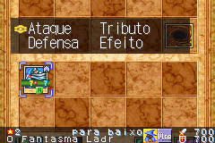
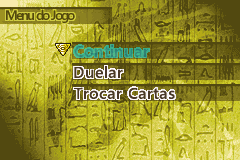
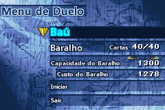
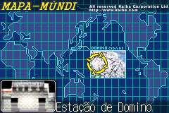
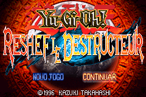
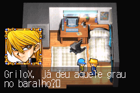
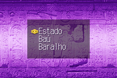
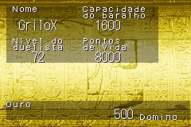
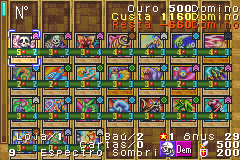
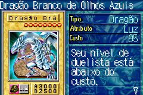
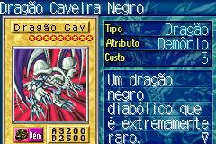
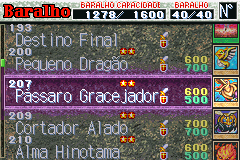