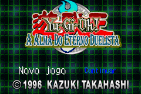
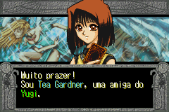
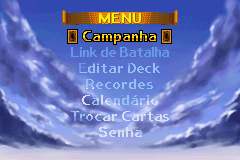

# Yu-Gi-Oh! The Eternal Duelist Soul

## Informações sobre o jogo

| Tipo | Informação |
| ----------- | ----------- |
| Nome | Yu\-Gi\-Oh\! The Eternal Duelist Soul |
| Plataforma | [Game Boy Advance](../) |
| Desenvolvedora | Konami |
| Distribuidora | Konami |
| Gênero | TCG |
| Data de Lançamento | 15/10/2002 |

## Informações sobre a tradução

| Tipo | Informação |
| ----------- | ----------- |
| Versão | 2\.0 beta |
| Última versão | Sim |
| Data de Lançamento | 26/12/2008 |
| Percentual traduzido | 90% |

## Autores

| Autor(a) | Papel na tradução |
| ----------- | ----------- |
| [Ilune](../../../autores/ilune/) | Completo |
| [Joapeer](../../../autores/joapeer/) | Completo |
| [Odin](../../../autores/odin/) | Completo |
| [Solid\_One](../../../autores/solid_one/) | Completo |

## Grupos

* [Trans\-Center](../../../grupos/trans-center/)
* [PO\.B\.R\.E](../../../grupos/pobre/)

## Informações sobre patching

| Aplicar o patch no arquivo | CRC32 Hash | MD5 Hash |
| ----------- | ----------- | ----------- |
| Yu\-Gi\-Oh\! The Eternal Duelist Soul \(U\)\.gba | DFD07A36 | EC3F000FFDE5754CB164A05D2D6F9053 |

## Páginas sobre a tradução

| URL | Oficial (publicado pelos autores) | Possuí link de download |
| ----------- | ----------- | ----------- |
| [https://romhackers.org/traducoes/portatil/game-boy-advance/yu-gi-oh-the-eternal-duelist-soul-po.b.r.e.-e-trans-center/](https://romhackers.org/traducoes/portatil/game-boy-advance/yu-gi-oh-the-eternal-duelist-soul-po.b.r.e.-e-trans-center/) | Sim | Sim |
| [https://www.zophar.net/translations/gameboy-advance/brazilian-portuguese/yu-gi-oh-the-eternal-duelist-soul.html](https://www.zophar.net/translations/gameboy-advance/brazilian-portuguese/yu-gi-oh-the-eternal-duelist-soul.html) | Não | Sim |

## Imagens da tradução

