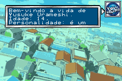
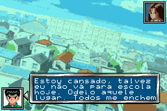
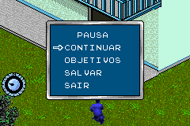
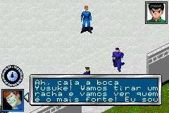

# Yu Yu Hakusho - Spirit Detective

## Informações sobre o jogo

| Tipo | Informação |
| ----------- | ----------- |
| Nome | Yu Yu Hakusho \- Spirit Detective |
| Plataforma | [Game Boy Advance](../) |
| Desenvolvedora | Sensory Sweep |
| Distribuidora | Atari |
| Gênero | RPG / Ação |
| Data de Lançamento | 02/12/2003 |

## Informações sobre a tradução

| Tipo | Informação |
| ----------- | ----------- |
| Versão | 1\.1 |
| Última versão | Sim |
| Data de Lançamento | 18/07/2005 |
| Percentual traduzido | 99% |

## Autores

| Autor(a) | Papel na tradução |
| ----------- | ----------- |
| [Dhuan](../../../autores/dhuan/) | Completo |

## Grupos

* [TransFac](../../../grupos/transfac/)

## Informações sobre patching

| Aplicar o patch no arquivo | CRC32 Hash | MD5 Hash |
| ----------- | ----------- | ----------- |
| Yu Yu Hakusho \- Spirit Detective \(U\)\.gba | D3784B52 | FFA7898EE8B3BC98E4156F3B5E7CDF63 |

## Páginas sobre a tradução

| URL | Oficial (publicado pelos autores) | Possuí link de download |
| ----------- | ----------- | ----------- |
| [https://romhackers.org/traducoes/portatil/game-boy-advance/yu-yu-hakusho-spirit-detective-transfac/](https://romhackers.org/traducoes/portatil/game-boy-advance/yu-yu-hakusho-spirit-detective-transfac/) | Não | Sim |
| [https://www.zophar.net/translations/gameboy-advance/brazilian-portuguese/yu-yu-hakusho-spirit-detective.html](https://www.zophar.net/translations/gameboy-advance/brazilian-portuguese/yu-yu-hakusho-spirit-detective.html) | Não | Sim |

## Imagens da tradução

