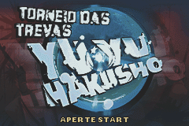
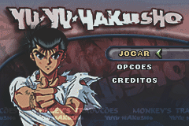
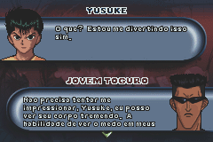
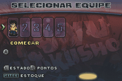
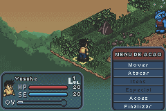

# Yu Yu Hakusho - Tournament Tactics

## Informações sobre o jogo

| Tipo | Informação |
| ----------- | ----------- |
| Nome | Yu Yu Hakusho \- Tournament Tactics |
| Plataforma | [Game Boy Advance](../) |
| Desenvolvedora | Sensory Sweep |
| Distribuidora | Atari |
| Gênero | Estratégia |
| Data de Lançamento | 18/11/2004 |

## Informações sobre a tradução

| Tipo | Informação |
| ----------- | ----------- |
| Versão | 1\.0b |
| Última versão | Sim |
| Data de Lançamento | 31/12/2008 |
| Percentual traduzido | 96% |

## Autores

| Autor(a) | Papel na tradução |
| ----------- | ----------- |
| [Lobim](../../../autores/lobim/) | Completo |
| [Sonic Away](../../../autores/sonic-away/) | Tradução |
| [Anime\_World](../../../autores/anime_world/) | Romhacking |
| [Hatsu\_Haru](../../../autores/hatsu_haru/) | Gráficos |
| [eskhotline](../../../autores/eskhotline/) | Gráficos |
| [Ceifer](../../../autores/ceifer/) | Revisão |

## Grupos

* [Monkey's Traduções](../../../grupos/monkeys-traducoes/)

## Informações sobre patching

| Aplicar o patch no arquivo | CRC32 Hash | MD5 Hash |
| ----------- | ----------- | ----------- |
| Yu Yu Hakusho \- Tournament Tactics \(U\)\.gba | AEF6B7CC | ACEFEBBE5FDF25AE83A386A6D1C09BCA |

## Páginas sobre a tradução

| URL | Oficial (publicado pelos autores) | Possuí link de download |
| ----------- | ----------- | ----------- |
| [https://www.romhacking.net/translations/3361/](https://www.romhacking.net/translations/3361/) | Não | Sim |
| [https://romhackers.org/traducoes/portatil/game-boy-advance/yu-yu-hakusho-tournament-tactics-monkeys-traducoes/](https://romhackers.org/traducoes/portatil/game-boy-advance/yu-yu-hakusho-tournament-tactics-monkeys-traducoes/) | Não | Não |

## Imagens da tradução

