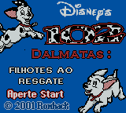
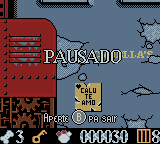
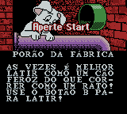

# 102 Dalmatians - Puppies to the Rescue

## Informações sobre o jogo

| Tipo | Informação |
| ----------- | ----------- |
| Nome | 102 Dalmatians \- Puppies to the Rescue |
| Plataforma | [Game Boy Color](../) |
| Desenvolvedora | Digital Eclipse Software |
| Distribuidora | Activision |
| Gênero | Ação / Plataforma |
| Data de Lançamento | 22/11/2000 |

## Informações sobre a tradução

| Tipo | Informação |
| ----------- | ----------- |
| Versão | 1\.0 |
| Última versão | Sim |
| Data de Lançamento | (Provavelmente) 13/05/2001 |
| Percentual traduzido | 100% |

## Autores

| Autor(a) | Papel na tradução |
| ----------- | ----------- |
| [Kuwanger](../../../autores/kuwanger/) | Completo |
| [OveR182](../../../autores/over182/) | Gráficos |

## Grupos

* [Romhack BR](../../../grupos/romhack-br/)

## Informações sobre patching

| Formato do patch | Aplicar o patch no arquivo | CRC32 Hash | MD5 Hash |
| ----------- | ----------- | ----------- | ----------- |
| IPS | 102 Dalmatians \- Puppies to the Rescue \(U\) \[C\]\[\!\]\.gbc | 56B83539 | 2B7E2442D503CE368FC93A9EBF0F70EF |

## Páginas sobre a tradução

| URL | Oficial (publicado pelos autores) | Possuí link de download |
| ----------- | ----------- | ----------- |
| [https://www.romhacking.net/translations/1930/](https://www.romhacking.net/translations/1930/) | Não | Sim |
| [https://www.zophar.net/translations/gameboy/portuguese/102-dalmations-puppies-to-the-rescue.html](https://www.zophar.net/translations/gameboy/portuguese/102-dalmations-puppies-to-the-rescue.html) | Não | Sim |
| [https://romhackers.org/traducoes/portatil/game-boy-color/102-dalmatians-puppies-to-the-rescue-romhack-br/](https://romhackers.org/traducoes/portatil/game-boy-color/102-dalmatians-puppies-to-the-rescue-romhack-br/) | Não | Não |

## Imagens da tradução

