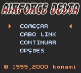
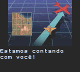
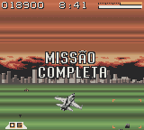

# AirForce Delta

## Informações sobre o jogo

| Tipo | Informação |
| ----------- | ----------- |
| Nome | AirForce Delta |
| Plataforma | [Game Boy Color](../) |
| Desenvolvedora | Climax |
| Distribuidora | Konami |
| Gênero | Shoot 'em up |
| Data de Lançamento | (Por volta de) ??/??/2000 |

## Informações sobre a tradução

| Tipo | Informação |
| ----------- | ----------- |
| Versão | 1\.21 |
| Última versão | Sim |
| Data de Lançamento | 04/02/2009 |
| Percentual traduzido | 100% |

## Autores

| Autor(a) | Papel na tradução |
| ----------- | ----------- |
| [Balboa](../../../autores/balboa/) | Completo |

## Grupos

* [Monkey's Traduções](../../../grupos/monkeys-traducoes/)

## Informações sobre patching

| Aplicar o patch no arquivo | CRC32 Hash | MD5 Hash |
| ----------- | ----------- | ----------- |
| AirForce Delta \(U\) \[C\]\[\!\]\.gbc | FF31CC92 | EE37C79E8DF6475D90E99E527823F92F |

## Páginas sobre a tradução

| URL | Oficial (publicado pelos autores) | Possuí link de download |
| ----------- | ----------- | ----------- |
| [https://www.zophar.net/translations/gameboy/brazilian-portuguese/airforce-delta.html](https://www.zophar.net/translations/gameboy/brazilian-portuguese/airforce-delta.html) | Não | Sim |
| [https://romhackers.org/traducoes/portatil/game-boy-color/airforce-delta-monkeys-traducoes/](https://romhackers.org/traducoes/portatil/game-boy-color/airforce-delta-monkeys-traducoes/) | Não | Não |

## Imagens da tradução

