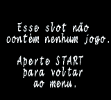
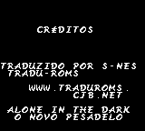
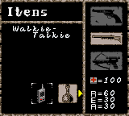

# Alone In The Dark - The New Nightmare

## Informações sobre o jogo

| Tipo | Informação |
| ----------- | ----------- |
| Nome | Alone In The Dark \- The New Nightmare |
| Plataforma | [Game Boy Color](../) |
| Desenvolvedora | Pocket Studios |
| Distribuidora | Infogrames |
| Gênero | Survival Horror |
| Data de Lançamento | 27/06/2001 |

## Informações sobre a tradução

| Tipo | Informação |
| ----------- | ----------- |
| Versão | 1\.0 |
| Última versão | Sim |
| Observação | Use o TGB\-Dual para emular esse jogo pois, este é o único emulador que emula esse jogo perfeitamente \(no VisualBoyAdvance o jogo trava logo após o último chefe ser derrotado, esse não é um bug da tradução e sim do emulador já que o mesmo travamento ocorre também na versão original do jogo\. |
| Data de Lançamento | 25/01/2003 |
| Percentual traduzido | 100% |

## Autores

| Autor(a) | Papel na tradução |
| ----------- | ----------- |
| [S\-NES](../../../autores/s-nes/) | Completo |

## Grupos

* [Tradu\-Roms](../../../grupos/tradu-roms/)

## Informações sobre patching

| Formato do patch | Aplicar o patch no arquivo | CRC32 Hash | MD5 Hash |
| ----------- | ----------- | ----------- | ----------- |
| IPS | Alone in the Dark \- The New Nightmare \(E\) \(M6\) \[C\]\[\!\]\.gbc | 7FF2042F | 30EC849758F703D7071E2AC28E048101 |

## Páginas sobre a tradução

| URL | Oficial (publicado pelos autores) | Possuí link de download |
| ----------- | ----------- | ----------- |
| [https://traduroms.github.io/tr/tradus/alone.htm](https://traduroms.github.io/tr/tradus/alone.htm) | Sim | Sim |
| [https://www.zophar.net/translations/gameboy/brazilian-portuguese/alone-in-the-dark-the-new-nightmare.html](https://www.zophar.net/translations/gameboy/brazilian-portuguese/alone-in-the-dark-the-new-nightmare.html) | Não | Sim |
| [https://romhackers.org/traducoes/portatil/game-boy-color/alone-in-the-dark-the-new-nightmare-tradu-roms/](https://romhackers.org/traducoes/portatil/game-boy-color/alone-in-the-dark-the-new-nightmare-tradu-roms/) | Não | Não |

## Imagens da tradução

