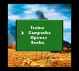
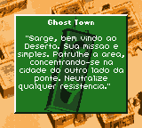
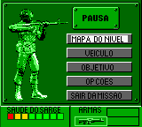

# Army Men

## Informações sobre o jogo

| Tipo | Informação |
| ----------- | ----------- |
| Nome | Army Men |
| Plataforma | [Game Boy Color](../) |
| Desenvolvedora | Digital Eclipse Software |
| Distribuidora | 3DO |
| Gênero | Ação |
| Data de Lançamento | (Por volta de) ??/02/2000 |

## Informações sobre a tradução

| Tipo | Informação |
| ----------- | ----------- |
| Versão | 0\.9 |
| Última versão | Sim |
| Data de Lançamento | 24/03/2013 |
| Percentual traduzido | 80% |

## Autores

| Autor(a) | Papel na tradução |
| ----------- | ----------- |
| [patryckpo](../../../autores/patryckpo/) | Completo |

## Informações sobre patching

| Aplicar o patch no arquivo | CRC32 Hash | MD5 Hash |
| ----------- | ----------- | ----------- |
| Army Men \(U\) \(M3\) \[C\]\[\!\]\.gbc | 34411753 | C75BF50B9FEC4E89CED9A2BDFBEB4245 |

## Páginas sobre a tradução

| URL | Oficial (publicado pelos autores) | Possuí link de download |
| ----------- | ----------- | ----------- |
| [https://www.zophar.net/translations/gameboy/brazilian-portuguese/army-men.html](https://www.zophar.net/translations/gameboy/brazilian-portuguese/army-men.html) | Não | Sim |
| [https://romhackers.org/traducoes/portatil/game-boy-color/army-men-patryck/](https://romhackers.org/traducoes/portatil/game-boy-color/army-men-patryck/) | Não | Não |
| [https://patryckpo.com/traducoes/gbc/army-men/](https://patryckpo.com/traducoes/gbc/army-men/) | Não | Sim, porém estão inativos |

## Imagens da tradução

