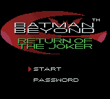
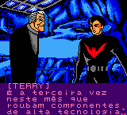
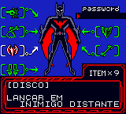

# Batman Beyond - Return of the Joker

## Informações sobre o jogo

| Tipo | Informação |
| ----------- | ----------- |
| Nome | Batman Beyond \- Return of the Joker |
| Plataforma | [Game Boy Color](../) |
| Desenvolvedora | Kemco |
| Distribuidora | Ubisoft |
| Gênero | Beat 'em up |
| Data de Lançamento | 20/11/2000 |

## Informações sobre a tradução

| Tipo | Informação |
| ----------- | ----------- |
| Versão | 1\.0 |
| Última versão | Sim |
| Data de Lançamento | 05/01/2009 |
| Percentual traduzido | 100% |

## Autores

| Autor(a) | Papel na tradução |
| ----------- | ----------- |
| [StackHouse](../../../autores/stackhouse/) | Completo |

## Grupos

* [PO\.B\.R\.E](../../../grupos/pobre/)

## Informações sobre patching

| Aplicar o patch no arquivo | CRC32 Hash | MD5 Hash |
| ----------- | ----------- | ----------- |
| Batman Beyond \- Return of the Joker \(U\) \[C\]\[\!\]\.gbc | B32F4586 | DD9E7C40F202F2C3963930E195D75F4D |

## Páginas sobre a tradução

| URL | Oficial (publicado pelos autores) | Possuí link de download |
| ----------- | ----------- | ----------- |
| [https://www.zophar.net/translations/gameboy/brazilian-portuguese/batman-beyond-return-of-the-joker.html](https://www.zophar.net/translations/gameboy/brazilian-portuguese/batman-beyond-return-of-the-joker.html) | Não | Sim |
| [https://romhackers.org/traducoes/portatil/game-boy-color/batman-beyond-return-of-the-joker-po.b.r.e](https://romhackers.org/traducoes/portatil/game-boy-color/batman-beyond-return-of-the-joker-po.b.r.e) | Não | Não |

## Imagens da tradução

