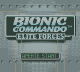
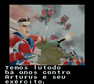
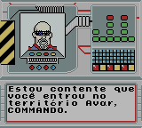

# Bionic Commando - Elite Forces

## Informações sobre o jogo

| Tipo | Informação |
| ----------- | ----------- |
| Nome | Bionic Commando \- Elite Forces |
| Plataforma | [Game Boy Color](../) |
| Desenvolvedora | Nintendo |
| Distribuidora | Nintendo |
| Gênero | Ação |
| Data de Lançamento | 26/01/2000 |

## Informações sobre a tradução

| Tipo | Informação |
| ----------- | ----------- |
| Versão | 1\.0 |
| Última versão | Sim |
| Data de Lançamento | 17/10/2014 |
| Percentual traduzido | 98% |

## Autores

| Autor(a) | Papel na tradução |
| ----------- | ----------- |
| [Merlim](../../../autores/merlim/) | Completo |

## Grupos

* [Trans\-Center](../../../grupos/trans-center/)

## Informações sobre patching

| Aplicar o patch no arquivo | CRC32 Hash | MD5 Hash |
| ----------- | ----------- | ----------- |
| Bionic Commando \- Elite Forces \(U\) \[C\]\[\!\]\.gbc | A663CF31 | B3347B3219A7183697E83655F4628827 |

## Páginas sobre a tradução

| URL | Oficial (publicado pelos autores) | Possuí link de download |
| ----------- | ----------- | ----------- |
| [https://www.zophar.net/translations/gameboy/brazilian-portuguese/bionic-commando-elite-forces.html](https://www.zophar.net/translations/gameboy/brazilian-portuguese/bionic-commando-elite-forces.html) | Não | Sim |
| [https://romhackers.org/traducoes/portatil/game-boy-color/bionic-commando-elite-forces-trans-center/](https://romhackers.org/traducoes/portatil/game-boy-color/bionic-commando-elite-forces-trans-center/) | Não | Não |

## Imagens da tradução

