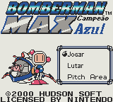
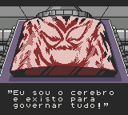
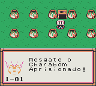

# Bomberman Max - Blue Champion

## Informações sobre o jogo

| Tipo | Informação |
| ----------- | ----------- |
| Nome | Bomberman Max \- Blue Champion |
| Plataforma | [Game Boy Color](../) |
| Desenvolvedora | Hudson |
| Distribuidora | Vatical Entertainment |
| Gênero | Puzzle |
| Data de Lançamento | 14/05/2000 |

## Informações sobre a tradução

| Tipo | Informação |
| ----------- | ----------- |
| Última versão | Sim |
| Data de Lançamento | 30/08/2008 |
| Percentual traduzido | 100% |

## Autores

| Autor(a) | Papel na tradução |
| ----------- | ----------- |
| [RodrigoX4](../../../autores/rodrigox4/) | Completo |

## Informações sobre patching

| Aplicar o patch no arquivo | CRC32 Hash | MD5 Hash |
| ----------- | ----------- | ----------- |
| Bomberman Max \- Blue Champion \(U\) \[C\]\[\!\]\.gbc | 5CCB66CF | C987F711DFB9CBA8DC1174219877360F |

## Páginas sobre a tradução

| URL | Oficial (publicado pelos autores) | Possuí link de download |
| ----------- | ----------- | ----------- |
| [https://www.zophar.net/translations/gameboy/brazilian-portuguese/bomberman-max-blue-champion.html](https://www.zophar.net/translations/gameboy/brazilian-portuguese/bomberman-max-blue-champion.html) | Não | Sim |
| [https://romhackers.org/traducoes/portatil/game-boy-color/bomberman-max-blue-champion-rodrigox4/](https://romhackers.org/traducoes/portatil/game-boy-color/bomberman-max-blue-champion-rodrigox4/) | Não | Não |

## Imagens da tradução

