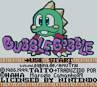
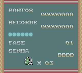
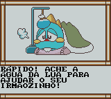

# Bubble Bobble

## Informações sobre o jogo

| Tipo | Informação |
| ----------- | ----------- |
| Nome | Bubble Bobble |
| Plataforma | [Game Boy Color](../) |
| Desenvolvedora | Taito |
| Distribuidora | Metro3D |
| Gênero | Ação / Plataforma |
| Data de Lançamento | 01/11/1999 |

## Informações sobre a tradução

| Tipo | Informação |
| ----------- | ----------- |
| Última versão | Sim |
| Data de Lançamento | (Provavelmente) 20/10/1999 |
| Percentual traduzido | None% |

## Autores

| Autor(a) | Papel na tradução |
| ----------- | ----------- |
| [Mac\_RJ](../../../autores/mac_rj/) | Completo |

## Grupos

* [Emuroms Translations](../../../grupos/emuroms-translations/)

## Informações sobre patching

| Aplicar o patch no arquivo | CRC32 Hash | MD5 Hash |
| ----------- | ----------- | ----------- |
| Bubble Bobble \(U\) \[C\]\[\!\]\.gbc | C1B22246 | 4BC8467ED91A94BA23648706B551CEF5 |

## Páginas sobre a tradução

| URL | Oficial (publicado pelos autores) | Possuí link de download |
| ----------- | ----------- | ----------- |
| [https://www.zophar.net/translations/gameboy/brazilian-portuguese/bubble-bobble.html](https://www.zophar.net/translations/gameboy/brazilian-portuguese/bubble-bobble.html) | Não | Sim |
| [https://romhackers.org/traducoes/portatil/game-boy-color/bubble-bobble-emuroms-translations/](https://romhackers.org/traducoes/portatil/game-boy-color/bubble-bobble-emuroms-translations/) | Não | Não |

## Imagens da tradução

