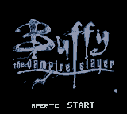
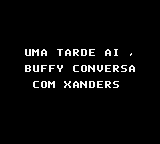
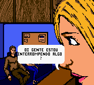
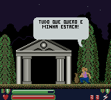

# Buffy - The Vampire Slayer

## Informações sobre o jogo

| Tipo | Informação |
| ----------- | ----------- |
| Nome | Buffy \- The Vampire Slayer |
| Plataforma | [Game Boy Color](../) |
| Desenvolvedora | GameBrains |
| Distribuidora | THQ |
| Gênero | Beat 'em up |
| Data de Lançamento | 25/09/2000 |

## Informações sobre a tradução

| Tipo | Informação |
| ----------- | ----------- |
| Última versão | Sim |
| Data de Lançamento | 23/08/2001 |
| Percentual traduzido | 100% |

## Autores

| Autor(a) | Papel na tradução |
| ----------- | ----------- |
| [Aniquilador](../../../autores/aniquilador/) | Completo |

## Grupos

* [BR Translations](../../../grupos/br-translations/)

## Informações sobre patching

| Formato do patch | Aplicar o patch no arquivo | CRC32 Hash | MD5 Hash |
| ----------- | ----------- | ----------- | ----------- |
| IPS | Buffy the Vampire Slayer \(U\) \[C\]\[\!\]\.gbc | 5692E262 | 49561C4082206A7E5D5CA2032BE81EED |

## Páginas sobre a tradução

| URL | Oficial (publicado pelos autores) | Possuí link de download |
| ----------- | ----------- | ----------- |
| [https://www.zophar.net/translations/gameboy/portuguese/buffy-the-vampire-slayer.html](https://www.zophar.net/translations/gameboy/portuguese/buffy-the-vampire-slayer.html) | Não | Sim |
| [https://www.romhacking.net/translations/1931/](https://www.romhacking.net/translations/1931/) | Não | Sim |
| [https://romhackers.org/traducoes/portatil/game-boy-color/buffy-the-vampire-slayer-br-translations/](https://romhackers.org/traducoes/portatil/game-boy-color/buffy-the-vampire-slayer-br-translations/) | Não | Não |

## Imagens da tradução

