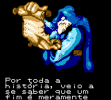
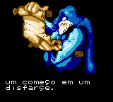
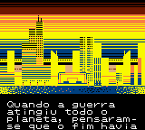
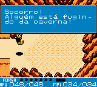

# Crystalis

## Informações sobre o jogo

| Tipo | Informação |
| ----------- | ----------- |
| Nome | Crystalis |
| Plataforma | [Game Boy Color](../) |
| Desenvolvedora | SNK |
| Distribuidora | Nintendo |
| Gênero | RPG / Ação |
| Data de Lançamento | 26/06/2000 |

## Informações sobre a tradução

| Tipo | Informação |
| ----------- | ----------- |
| Versão | 1\.2 |
| Última versão | Sim |
| Data de Lançamento | 19/06/2002 |
| Percentual traduzido | 100% |

## Autores

| Autor(a) | Papel na tradução |
| ----------- | ----------- |
| [Kuwanger](../../../autores/kuwanger/) | Completo |
| [Laura Lanford](../../../autores/laura-lanford/) | Tradução |
| [Majin Alucard](../../../autores/majin-alucard/) | Tradução e revisão |
| [King Delita](../../../autores/king-delita/) | Revisão |

## Grupos

* [Romhack BR](../../../grupos/romhack-br/)

## Informações sobre patching

| Formato do patch | Aplicar o patch no arquivo | CRC32 Hash | MD5 Hash |
| ----------- | ----------- | ----------- | ----------- |
| IPS | Crystalis \(U\) \[C\]\[\!\]\.gbc | 909BB02D | F36A0ED25A601C039B1171D9DAF241D6 |

## Páginas sobre a tradução

| URL | Oficial (publicado pelos autores) | Possuí link de download |
| ----------- | ----------- | ----------- |
| [https://www.romhacking.net/translations/1932/](https://www.romhacking.net/translations/1932/) | Não | Sim |
| [https://www.zophar.net/translations/gameboy/portuguese/crystalis.html](https://www.zophar.net/translations/gameboy/portuguese/crystalis.html) | Não | Sim |
| [https://romhackers.org/traducoes/portatil/game-boy-color/crystalis-romhack-br/](https://romhackers.org/traducoes/portatil/game-boy-color/crystalis-romhack-br/) | Não | Não |

## Imagens da tradução

