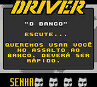
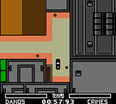
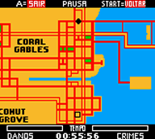
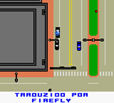
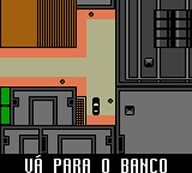
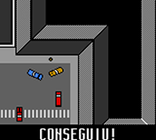
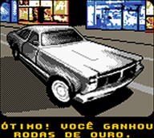

# Driver - You are the Wheelman

## Informações sobre o jogo

| Tipo | Informação |
| ----------- | ----------- |
| Nome | Driver \- You are the Wheelman |
| Plataforma | [Game Boy Color](../) |
| Desenvolvedora | Crawfish Interactive |
| Distribuidora | Infogrames |
| Gênero | Corrida |
| Data de Lançamento | (Por volta de) ??/04/2000 |

## Informações sobre a tradução

| Tipo | Informação |
| ----------- | ----------- |
| Versão | 1\.0 |
| Última versão | Sim |
| Data de Lançamento | 29/09/2018 |
| Percentual traduzido | 100% |

## Autores

| Autor(a) | Papel na tradução |
| ----------- | ----------- |
| [FireFly](../../../autores/firefly/) | Completo |

## Informações sobre patching

| Aplicar o patch no arquivo | CRC32 Hash | MD5 Hash |
| ----------- | ----------- | ----------- |
| Driver \- You Are The Wheelman \(U\) \(M5\) \[C\]\[\!\]\.gbc | D4C7F6DF | 413E1ACD7847D628364163EB2C97CECD |

## Páginas sobre a tradução

| URL | Oficial (publicado pelos autores) | Possuí link de download |
| ----------- | ----------- | ----------- |
| [https://www.romhacking.net/translations/3890/](https://www.romhacking.net/translations/3890/) | Sim | Sim |
| [https://www.romhacking.net.br/index.php?topic=848](https://www.romhacking.net.br/index.php?topic=848) | Sim | Sim, porém é necessário realizar login |
| [https://joao13traducoes.com/2018/09/gbc-driver-you-are-wheelman-firefly/](https://joao13traducoes.com/2018/09/gbc-driver-you-are-wheelman-firefly/) | Não | Sim, porém o arquivo ou página de download exige uma senha |

## Imagens da tradução

