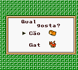
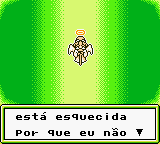
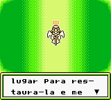

# Harvest Moon GB

## Informações sobre o jogo

| Tipo | Informação |
| ----------- | ----------- |
| Nome | Harvest Moon GB |
| Plataforma | [Game Boy Color](../) |
| Desenvolvedora | Victor Interactive Software |
| Distribuidora | Natsume |
| Gênero | Simulação |
| Data de Lançamento | 31/12/1998 |

## Informações sobre a tradução

| Tipo | Informação |
| ----------- | ----------- |
| Última versão | Sim |
| Observação | Aparentemente a tradução funciona na versão europeia e americana\. |
| Data de Lançamento | 04/07/2001 |
| Percentual traduzido | 97% |

## Autores

| Autor(a) | Papel na tradução |
| ----------- | ----------- |
| [Raph\_friend](../../../autores/raph_friend/) | Completo |
| [Desafo](../../../autores/desafo/) | Revisão |
| [Duck\-fs](../../../autores/duck-fs/) | Revisão |

## Grupos

* [BR Translations](../../../grupos/br-translations/)

## Informações sobre patching

| Aplicar o patch no arquivo | CRC32 Hash | MD5 Hash |
| ----------- | ----------- | ----------- |
| Harvest Moon GB \(U\) \[C\]\[\!\]\.gbc | AB5738A1 | 498C0A50A5E5CDE16127617A97AD6162 |
| Harvest Moon GB \(E\) \[C\]\[\!\]\.gbc | C8A6F68A | A5BC2E2AD58BBD78609478A60DCDA8D7 |

## Páginas sobre a tradução

| URL | Oficial (publicado pelos autores) | Possuí link de download |
| ----------- | ----------- | ----------- |
| [https://www.zophar.net/translations/gameboy/portuguese/harvest-moon-gbc.html](https://www.zophar.net/translations/gameboy/portuguese/harvest-moon-gbc.html) | Não | Sim |
| [https://www.romhacking.net/translations/1933/](https://www.romhacking.net/translations/1933/) | Não | Sim |
| [https://romhackers.org/traducoes/portatil/game-boy-color/harvest-moon-gbc-br-translations/](https://romhackers.org/traducoes/portatil/game-boy-color/harvest-moon-gbc-br-translations/) | Não | Não |

## Imagens da tradução

