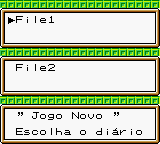
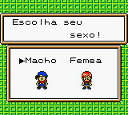
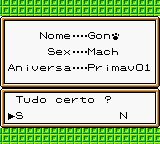
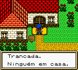

# Harvest Moon GBC 2

## Informações sobre o jogo

| Tipo | Informação |
| ----------- | ----------- |
| Nome | Harvest Moon GBC 2 |
| Plataforma | [Game Boy Color](../) |
| Desenvolvedora | Natsume |
| Distribuidora | Natsume |
| Gênero | Simulação |
| Data de Lançamento | 11/09/2000 |

## Informações sobre a tradução

| Tipo | Informação |
| ----------- | ----------- |
| Versão | 1\.0 |
| Última versão | Sim |
| Data de Lançamento | 08/01/2002 |
| Percentual traduzido | 95% |

## Autores

| Autor(a) | Papel na tradução |
| ----------- | ----------- |
| [Sanozuke](../../../autores/sanozuke/) | Completo |
| [Majin Alucard](../../../autores/majin-alucard/) | Revisão |
| [King Delita](../../../autores/king-delita/) | Revisão |

## Grupos

* [Romhack BR](../../../grupos/romhack-br/)

## Informações sobre patching

| Aplicar o patch no arquivo | CRC32 Hash | MD5 Hash |
| ----------- | ----------- | ----------- |
| Harvest Moon 2 GBC \(U\) \[C\]\[\!\]\.gbc | 08906220 | A539A7A02639395AD8D7723199C81EAE |

## Páginas sobre a tradução

| URL | Oficial (publicado pelos autores) | Possuí link de download |
| ----------- | ----------- | ----------- |
| [https://www.zophar.net/translations/gameboy/brazilian-portuguese/harvest-moon-gbc-2.html](https://www.zophar.net/translations/gameboy/brazilian-portuguese/harvest-moon-gbc-2.html) | Não | Sim |
| [https://romhackers.org/traducoes/portatil/game-boy-color/harvest-moon-gbc-2-romhack-br/](https://romhackers.org/traducoes/portatil/game-boy-color/harvest-moon-gbc-2-romhack-br/) | Não | Não |

## Imagens da tradução

