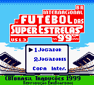
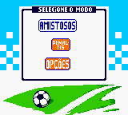
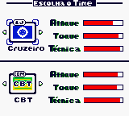
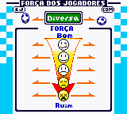
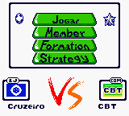

# International Superstar Soccer '99

## Informações sobre o jogo

| Tipo | Informação |
| ----------- | ----------- |
| Nome | International Superstar Soccer '99 |
| Plataforma | [Game Boy Color](../) |
| Desenvolvedora | Konami |
| Distribuidora | Konami |
| Gênero | Esportes |
| Data de Lançamento | 15/05/1999 |

## Informações sobre a tradução

| Tipo | Informação |
| ----------- | ----------- |
| Versão | 1\.3 |
| Última versão | Sim |
| Data de Lançamento | 02/01/2000 |
| Percentual traduzido | None% |

## Autores

| Autor(a) | Papel na tradução |
| ----------- | ----------- |
| [Emuboarding](../../../autores/emuboarding/) | Completo |

## Grupos

* [CBT](../../../grupos/cbt/)

## Informações sobre patching

| Aplicar o patch no arquivo | CRC32 Hash | MD5 Hash |
| ----------- | ----------- | ----------- |
| International Superstar Soccer '99 \(U\) \[C\]\[\!\]\.gbc | 9D0290A7 | 36DF5EBE75980AC4409DEAD125247BCE |

## Páginas sobre a tradução

| URL | Oficial (publicado pelos autores) | Possuí link de download |
| ----------- | ----------- | ----------- |
| [https://www.zophar.net/translations/gameboy/portuguese/international-superstar-soccer-99.html](https://www.zophar.net/translations/gameboy/portuguese/international-superstar-soccer-99.html) | Não | Sim |
| [https://www.romhacking.net/translations/1934/](https://www.romhacking.net/translations/1934/) | Não | Sim |
| [https://romhackers.org/traducoes/portatil/game-boy-color/international-superstar-soccer-99-cbt/](https://romhackers.org/traducoes/portatil/game-boy-color/international-superstar-soccer-99-cbt/) | Não | Não |

## Imagens da tradução

