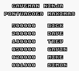
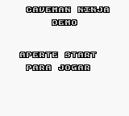
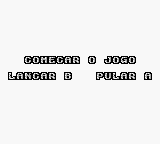
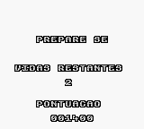

# Joe &amp; Mac

## Informações sobre o jogo

| Tipo | Informação |
| ----------- | ----------- |
| Nome | Joe &amp; Mac |
| Plataforma | [Game Boy Color](../) |
| Desenvolvedora | Motivetime |
| Distribuidora | Data East |
| Gênero | Ação / Plataforma |
| Data de Lançamento | (Por volta de) ??/04/1993 |

## Informações sobre a tradução

| Tipo | Informação |
| ----------- | ----------- |
| Última versão | Sim |
| Data de Lançamento | 03/04/2022 |
| Percentual traduzido | None% |

## Autores

| Autor(a) | Papel na tradução |
| ----------- | ----------- |
| [Green Jerry](../../../autores/green-jerry/) | Completo |

## Informações sobre patching

| Formato do patch | Aplicar o patch no arquivo | CRC32 Hash | MD5 Hash |
| ----------- | ----------- | ----------- | ----------- |
| IPS | Joe &amp; Mac \(U\) \[\!\]\.gb | 5DA86ED4 | A4627FB86C2B91FC0ACE4F628AA607E4 |

## Páginas sobre a tradução

| URL | Oficial (publicado pelos autores) | Possuí link de download |
| ----------- | ----------- | ----------- |
| [https://www.zophar.net/translations/gameboy/portuguese/joe-mac.html](https://www.zophar.net/translations/gameboy/portuguese/joe-mac.html) | Sim | Sim |

## Imagens da tradução

