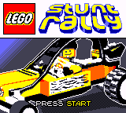
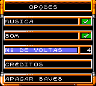
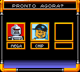

# LEGO Stunt Rally

## Informações sobre o jogo

| Tipo | Informação |
| ----------- | ----------- |
| Nome | LEGO Stunt Rally |
| Plataforma | [Game Boy Color](../) |
| Desenvolvedora | Graphic State |
| Distribuidora | Lego Media |
| Gênero | Corrida |
| Data de Lançamento | 29/12/2000 |

## Informações sobre a tradução

| Tipo | Informação |
| ----------- | ----------- |
| Última versão | Sim |
| Data de Lançamento | (Provavelmente) 13/12/2002 |
| Percentual traduzido | 100% |

## Autores

| Autor(a) | Papel na tradução |
| ----------- | ----------- |
| [Emcubador](../../../autores/emcubador/) | Completo |

## Grupos

* [BR Tradu](../../../grupos/br-tradu/)

## Informações sobre patching

| Aplicar o patch no arquivo | CRC32 Hash | MD5 Hash |
| ----------- | ----------- | ----------- |
| LEGO Stunt Rally \(U\) \[C\]\[\!\]\.gbc | DA084760 | C468C6D714A2D86E2F68BDCDBB40B658 |

## Páginas sobre a tradução

| URL | Oficial (publicado pelos autores) | Possuí link de download |
| ----------- | ----------- | ----------- |
| [https://www.zophar.net/translations/gameboy/brazilian-portuguese/lego-stunt-rally.html](https://www.zophar.net/translations/gameboy/brazilian-portuguese/lego-stunt-rally.html) | Não | Sim |
| [https://romhackers.org/traducoes/portatil/game-boy-color/lego-stunt-rally-br-tradu/](https://romhackers.org/traducoes/portatil/game-boy-color/lego-stunt-rally-br-tradu/) | Não | Não |

## Imagens da tradução

